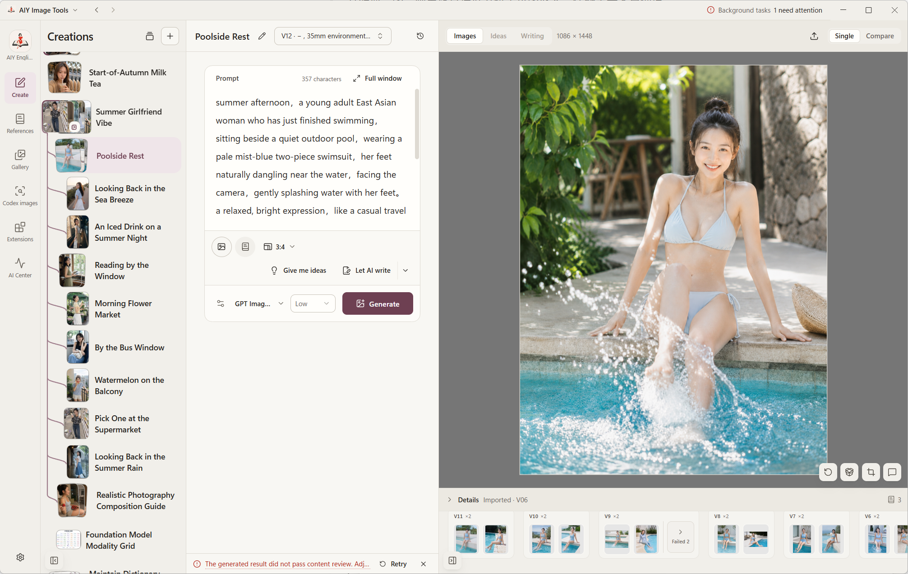
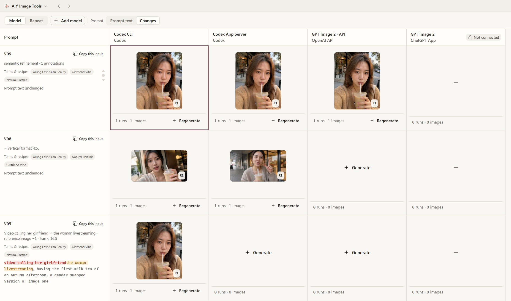
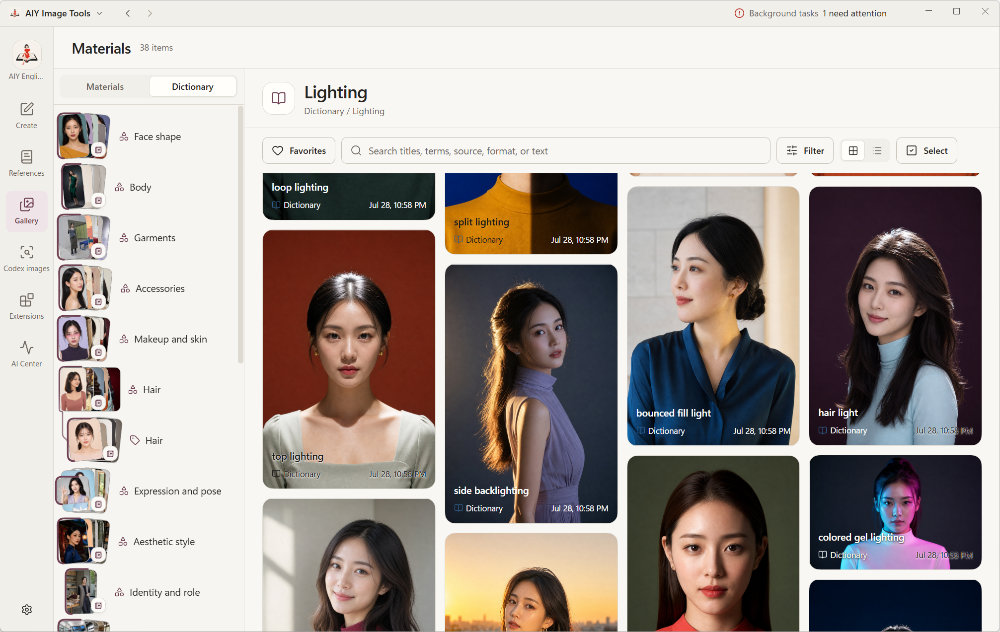
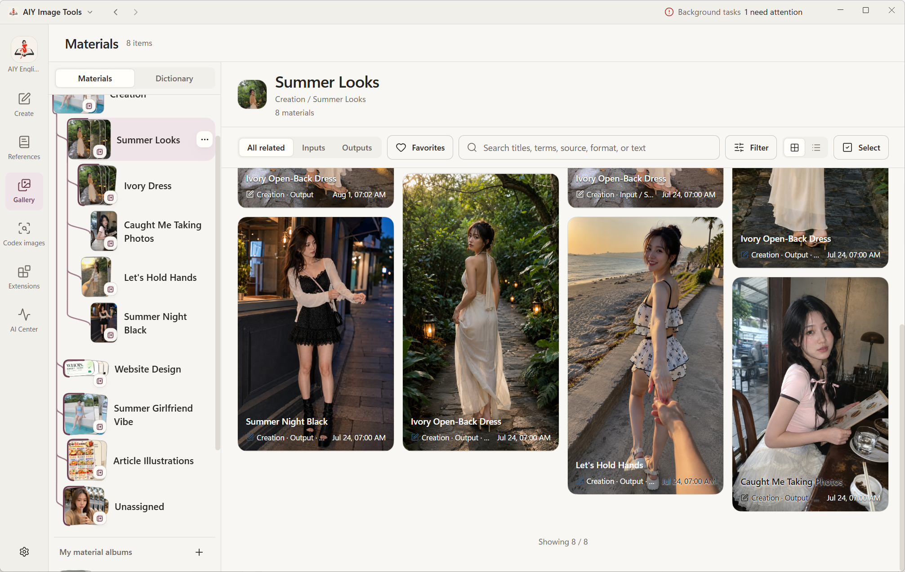
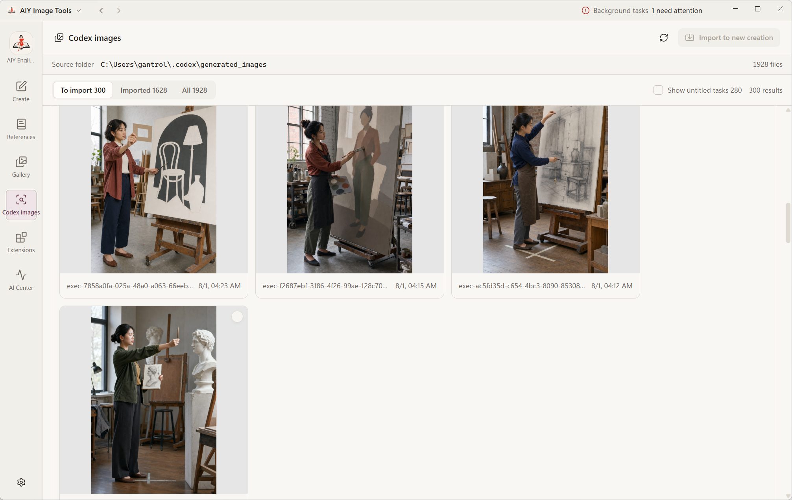

<div align="center">
  
  <h1>AIY</h1>
  <p><strong>AI × DIY</strong></p>
  <p>You create. AI helps.</p>
  <p>Collect and compare AI results, refine prompts, and build on what works</p>
  <p>
    <a href="README.en.md"></a>
    <a href="README.md"></a>
  </p>

  <p>
    <a href="https://github.com/gantrol/aiy-desktop/releases/latest"></a>
    <a href="https://apps.microsoft.com/detail/9nwd1hg6tczh"></a>
    <a href="LICENSE"></a>
  </p>

  <p>
    <a href="https://github.com/gantrol/aiy-desktop/releases/latest"><strong>Release history</strong></a> ·
    <a href="#what-you-can-do-today">Features</a> ·
    <a href="#next-video--illustrated-article">What's next</a> ·
    <a href="https://github.com/gantrol/aiy-desktop/issues">Feedback</a>
  </p>
</div>


I often ran into the same problem after generating images with AI: the images kept piling up, while the prompts and original conversations were scattered across different places. A few days later, I could not find them either.

So I built AIY.

You can give it images and videos. It can even scan Codex's local image-generation records and import each image together with its original conversation. Then you can compare multiple results side by side, annotate specific regions, and keep editing.

Prompts worth keeping can be organized into a dictionary or a “recipe”—a reusable prompt template with parameters.

Generation can go through Codex, or you can configure your own API.

<table>
  <tr>
    <td width="50%" valign="top">
      <a href="docs/assets/readme-creator.png"></a>
      <br />
      <strong>Manage AI generation by result</strong><br />
    </td>
    <td width="50%" valign="top">
      <a href="docs/assets/diff.png"></a>
      <br />
      <strong>Compare from multiple angles</strong>
    </td>
  </tr>
  <tr>
    <td width="50%" valign="top">
      <a href="docs/assets/readme-dictionary.png"></a>
      <br />
      <strong>Build your own visual dictionary</strong><br />
    </td>
    <td width="50%" valign="top">
      <a href="docs/assets/readme-gallery.png"></a>
      <br />
      <strong>Keep a traceable creative memory</strong>
    </td>
  </tr>
</table>

### From Codex back to your library

<p align="center">
  <a href="docs/assets/readme-codex-import.png">
    
  </a>
</p>

AIY can scan the local Codex generated-images directory, group results by task, avoid duplicate imports, link each imported result to its source task, and reopen the original task when needed. It only reads local Codex records; it does not scan web-chat history.

Bulk automated downloads from the web could violate service terms and put accounts at risk, so that part is intentionally out of scope.

## Local-first, bring your own remote models

Library metadata and managed media are stored in local spaces backed by SQLite. AIY does not require a hosted account, and it does not upload your entire library to an AIY server.

When you use AI features, the app still connects to the provider you choose. The prompt, reference images, and related data selected for that request are sent to the corresponding service and handled under its terms, privacy policy, and billing rules. Current routes include Codex App Server/CLI, the OpenAI Image API, and DeepSeek prompt assistance; Gemini, Qwen Image, and Seedream extensions are still awaiting acceptance testing.

## Distribution

The maintained distribution target from `v0.3.7` onward is:

- Windows 10/11 x64 — Microsoft Store MSIX.

Normal build scripts no longer produce NSIS installers, portable ZIPs, macOS DMGs, macOS ZIPs, or standalone unpacked releases. Historical packages remain in [GitHub Releases](https://github.com/gantrol/aiy-desktop/releases), but they are outside the maintained release matrix. Current packages are distributed through Microsoft Store after certification.

Download the Windows app from [Microsoft Store](https://apps.microsoft.com/detail/9nwd1hg6tczh). Other platforms currently require building from source; see the [development guide](docs/development.md).

## ❕Early stage

AIY is still very early. As of `v0.3.10`, image creation and the library are usable, but extensions and content packs may still change.

The basic framework is in place. Real user feedback is what will determine where this project goes next.

If you have also watched the image count rise while your prompts became harder to find, [try AIY](https://github.com/gantrol/aiy-desktop/releases/latest). If you think this direction is useful, a ⭐ [Star](https://github.com/gantrol/aiy-desktop) can help more creators discover it.

## Run from source

You need Node.js 22 or newer. The normal npm workflow supports source evaluation on Windows, macOS, and Ubuntu x64; Linux packages are not currently distributed. For the corresponding AI features, you will also need model credentials or an authenticated Codex CLI.

```bash
git clone https://github.com/gantrol/aiy-desktop.git
cd aiy-desktop
npm ci
npm run dev
```

AIY is built with Electron, React, TypeScript, Tailwind CSS, and SQLite. See the [development guide](docs/development.md) for runtime data locations, validation commands, extension development, and release workflows.

The [browser companion](browser-companion/README.md) lives in this repository with its own dependencies and version. Run `npm run install:browser`, then `npm run build:browser`; load `browser-companion/.output/chrome-mv3` as an unpacked Chrome or Edge extension. Use `npm run dev:browser` for extension development.

## License and security

AIY is provided under the [PolyForm Noncommercial License 1.0.0](LICENSE), which permits use, modification, and distribution for noncommercial purposes. Commercial use requires separate authorization.

Please report vulnerabilities through the private process described in [SECURITY.md](SECURITY.md). Do not submit credentials, personal data, or vulnerability details in a public issue.
