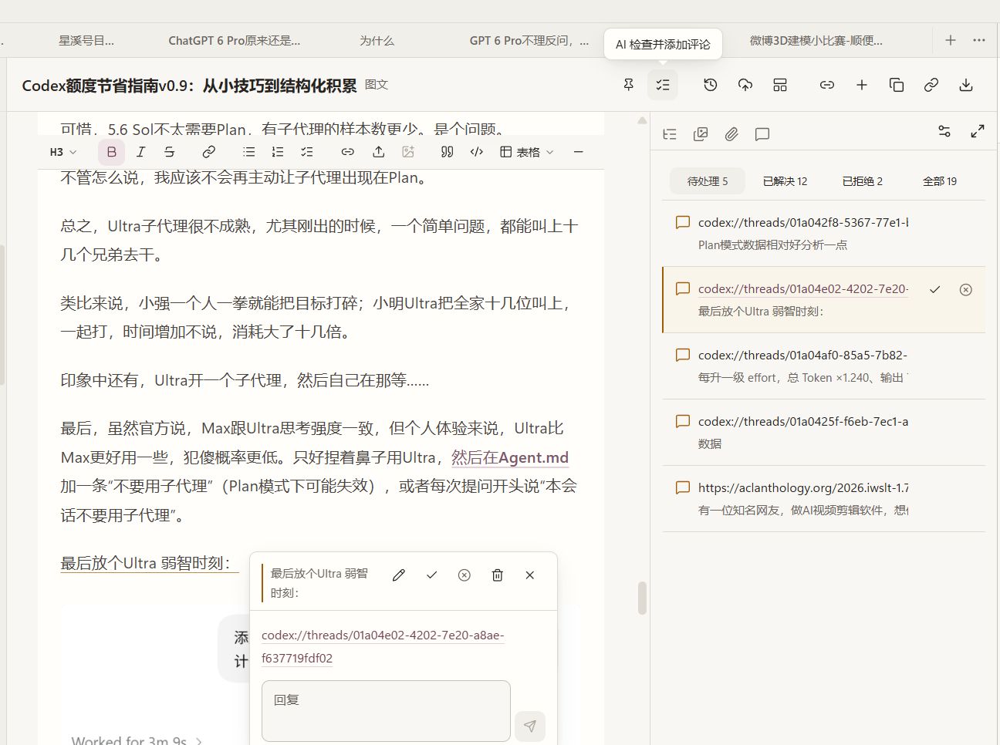
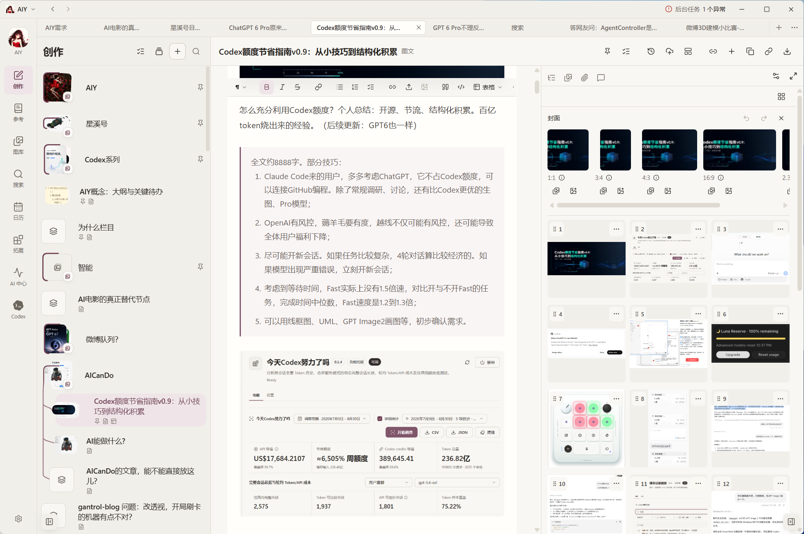
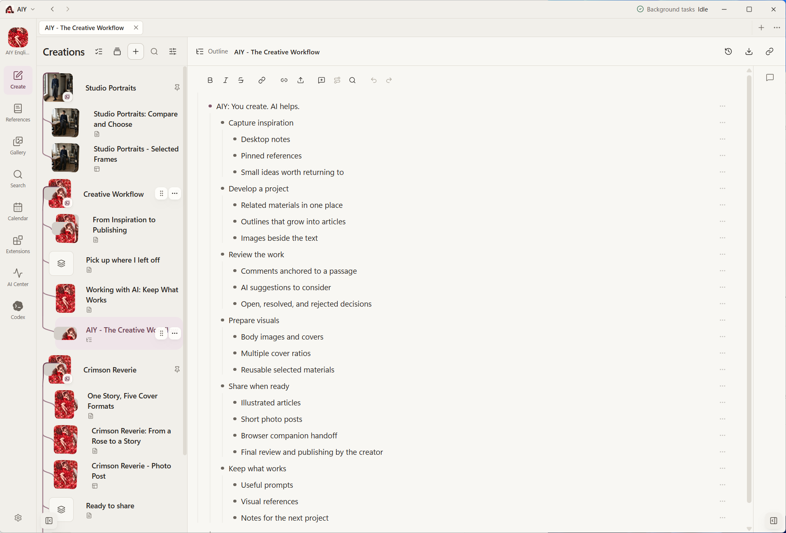
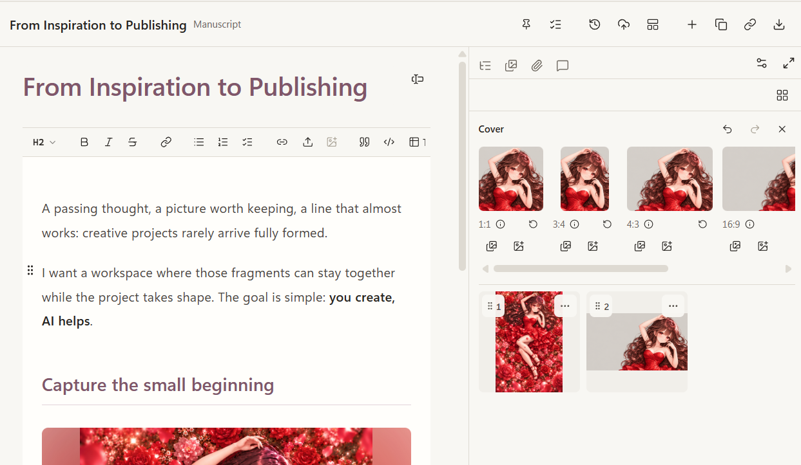
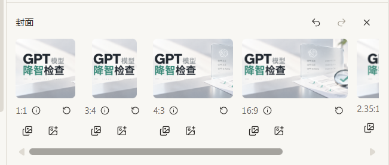

<div align="center">
  
  <h1>AIY：AI 帮你 DIY</h1>
  <p><strong>以人为主，AI辅助，从灵感到发布</strong></p>
  <p>
    <a href="https://apps.microsoft.com/detail/9nwd1hg6tczh"><strong>下载 Windows 版</strong></a> ·
    <a href="README.en.md">English</a>
  </p>
  <p>
    <a href="https://github.com/gantrol/aiy-desktop/releases"></a>
    <a href="https://apps.microsoft.com/detail/9nwd1hg6tczh"></a>
    <a href="LICENSE"></a>
  </p>
</div>


我用AI生图以后，经常遇到一个问题：图片越来越多，Prompt 和原会话却散落在不同地方，过几天自己都找不到。

由此做了 AIY。有了初版图片管理功能。

在不断迭代中，发现了“从灵感到发布”这条需求线。由于最近AI功能都主要推荐用Codex跟ChatGPT，开发出拓展「Codex今天努力了吗」跟交接给ChatGPT等功能。


## 从灵感到发布

<table>
  <tr>
    <td width="50%" valign="top">
      <a href="docs/assets/readme-inspiration.zh-CN.png"></a>
      <br />
      <strong>灵感</strong>
      <p>把便签和参考图贴到桌面，随时记下想法。</p>
    </td>
    <td width="50%" valign="top">
      <a href="docs/assets/readme-comments.zh-CN.png"></a>
      <br />
      <strong>评论与 AI 评论</strong>
      <p>围绕正文添加评论，也可让 AI 检查并添加评论；逐条处理、解决或拒绝建议。</p>
    </td>
  </tr>
  <tr>
    <td width="50%" valign="top">
      <a href="docs/assets/readme-article.zh-CN.png"></a>
      <br />
      <strong>文章</strong>
      <p>编辑图文，把正文、引用和图片整理在同一份作品中。</p>
    </td>
    <td width="50%" valign="top">
      <a href="docs/assets/readme-outline.png"></a>
      <br />
      <strong>大纲</strong>
      <p>用层级条目整理思路、折叠分支，再逐步展开成正文。</p>
    </td>
  </tr>
  <tr>
    <td width="50%" valign="top">
      <a href="docs/assets/readme-illustrations.png"></a>
      <br />
      <strong>配图</strong>
      <p>集中管理正文配图与封面，为不同用途准备多种封面比例。</p>
    </td>
    <td width="50%" valign="top">
		<a href="docs/assets/readme-cover-ratios.zh-CN.png"></a>
		<br />
      <strong>发布</strong>
      <p>复用已有正文与图片，通过 <a href="browser-companion/README.md">AIY 浏览器伴侣</a>填入微信公众号、小红书、微博等平台的编辑页面。由你检查内容并点击发布，软件本体不做自动发布。</p>
    </td>
  </tr>
</table>


## Codex今天努力了吗？

<p align="center">
  <a href="docs/assets/readme-codex-import.zh-CN.png">
    
  </a>
</p>
AIY 可以扫描本机 Codex 的生成图片目录，按任务分组、避免重复导入，把来源任务关联到导入结果，并在需要时重新打开原任务。它只读取本地 Codex 记录，不扫描网页端聊天记录。

可惜，网页端批量自动下载可能违反服务条款并带来账号风险，因此这部分刻意不做。

## 初版图片管理

<table>
  <tr>
    <td width="50%" valign="top">
      <a href="docs/assets/readme-creator.zh-CN.png"></a>
      <br />
      <strong>以成果维度，管理AI生成</strong><br />
    </td>
    <td width="50%" valign="top">
      <a href="docs/assets/diff.zh-CN.png"></a>
      <br />
      <strong>多维对比模式</strong>
    </td>
  </tr>
  <tr>
    <td width="50%" valign="top">
      <a href="docs/assets/readme-dictionary.zh-CN.png"></a>
      <br />
      <strong>自己的视觉词典</strong><br />
    </td>
    <td width="50%" valign="top">
      <a href="docs/assets/readme-gallery.zh-CN.png"></a>
      <br />
      <strong>可回溯创作记忆</strong>
    </td>
  </tr>
</table>

## 本地优先，自接远程模型

资料库元数据和受管媒体保存在由 SQLite 支撑的本地空间中。AIY 不要求注册托管账号，也不会把整个资料库上传到 AIY 服务器。

使用 AI 能力时，应用仍会连接你选择的服务。该次请求选中的 Prompt、参考图和相关数据会交给对应服务，并受其条款、隐私政策和计费规则约束。当前通道包括 Codex App Server/CLI、OpenAI Image API 和 DeepSeek Prompt 辅助；Gemini、Qwen Image 与 Seedream 扩展仍处于待验收阶段。

## 分发

从 `v0.3.7` 起，维护中的分发目标只有：

- Windows 10/11 x64：Microsoft Store MSIX。

普通构建脚本不再生成 NSIS、便携 ZIP、macOS DMG、macOS ZIP 或独立 unpacked 版本。历史安装包仍保留在 [GitHub Releases](https://github.com/gantrol/aiy-desktop/releases)，但不属于当前维护矩阵；当前版本通过 Microsoft Store 认证后由 Store 分发。

Windows 请从 [Microsoft Store 下载](https://apps.microsoft.com/detail/9nwd1hg6tczh)。其他平台暂时需要自行从源码编译，参见[开发文档](docs/development.md)。

## ❕早期阶段

AIY 目前仍处于早期开发阶段。到 v0.3.10，图像创作与素材库已可用，扩展与内容包后续仍可能变化。

## 从源码运行

需要 Node.js 22 或更高版本。Windows、macOS 和 Ubuntu x64 均可使用标准 npm 流程从源码试用；Linux 当前不提供安装包。使用对应 AI 功能时，还需要模型凭据或已登录的 Codex CLI。

```bash
git clone https://github.com/gantrol/aiy-desktop.git
cd aiy-desktop
npm ci
npm run dev
```

AIY 基于 Electron、React、TypeScript、Tailwind CSS 和 SQLite 构建。运行时数据位置、验证命令、扩展开发和发布流程见[开发文档](docs/development.md)。

[浏览器伴侣](browser-companion/README.md) 在本仓库内管理，保留独立依赖和版本。先运行 `npm run install:browser`，再运行 `npm run build:browser`，在 Chrome 或 Edge 中加载 `browser-companion/.output/chrome-mv3`。开发插件使用 `npm run dev:browser`。

## 许可与安全

AIY 依据 [PolyForm Noncommercial License 1.0.0](LICENSE) 提供源码，允许非商业目的的使用、修改和分发；商业用途需要另行授权。

请按照 [SECURITY.md](SECURITY.md) 中的私密流程报告漏洞，不要在公开 Issue 中提交凭据、个人数据或漏洞细节。
