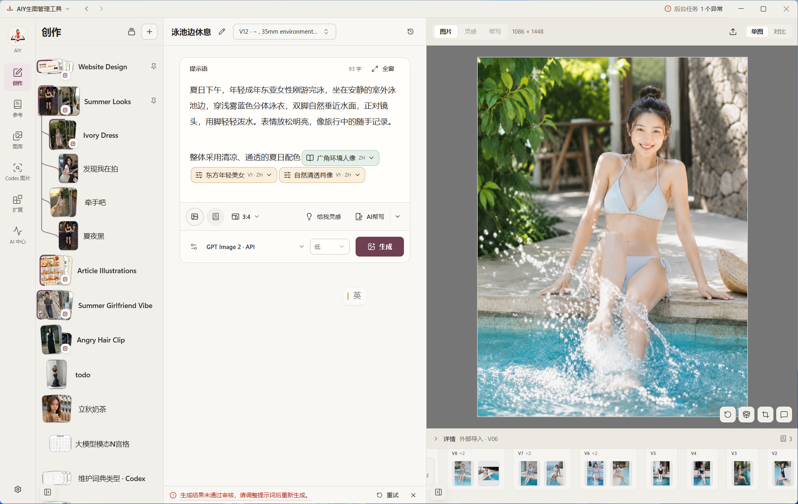
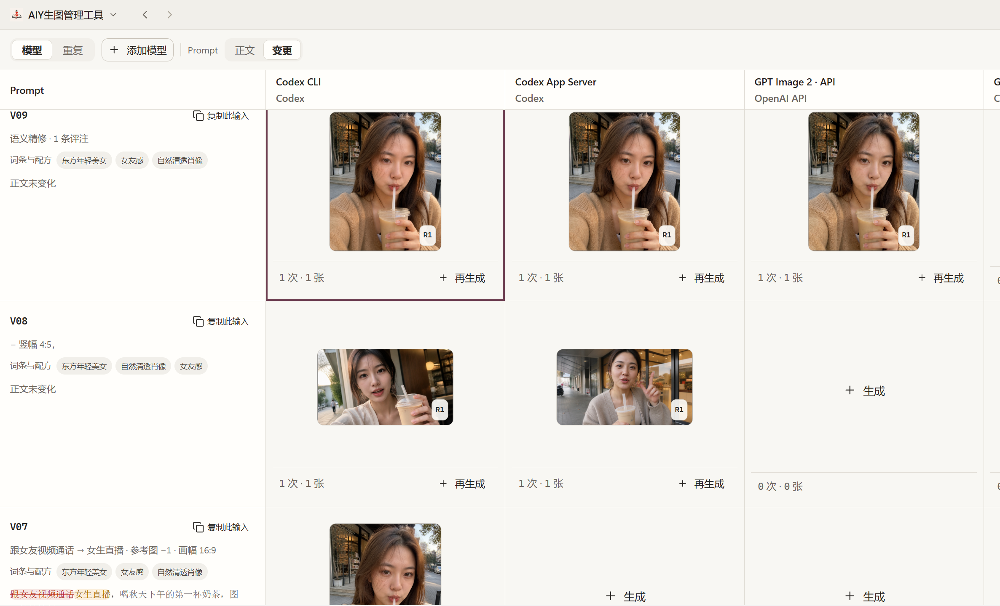
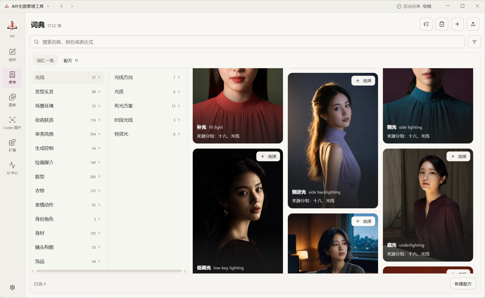
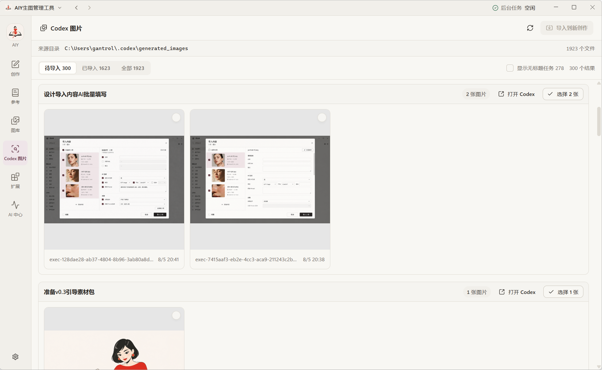

<div align="center">
  
  <h1>AIY：AI帮你DIY</h1>
  <p>收集、对比AI成果，优化Prompt、积累经验</p>
  <p>
    <a href="README.md"></a>
    <a href="README.zh-CN.md"></a>
  </p>


  <p>
    <a href="https://github.com/gantrol/aiy-desktop/releases/latest"></a>
    
    <a href="LICENSE"></a>
  </p>

  <p>
    
    
    
    
    
  </p>

  <p>
    <a href="https://github.com/gantrol/aiy-desktop/releases/latest"><strong>下载体验</strong></a> ·
    <a href="#目前能做什么">功能</a> ·
    <a href="#下一步视频--图文稿">下一步</a> ·
    <a href="https://github.com/gantrol/aiy-desktop/issues">反馈</a>
  </p>
</div>

我用AI生图以后，经常遇到一个问题：图片越来越多，Prompt 和原会话却散落在不同地方，过几天自己都找不到。

由此做了 AIY。

你可以把图片、视频交给它，甚至可以扫描 Codex 里的生图记录，把图片和原会话一起导进来。之后可以把多个结果放在一起比较，给图片做区域标注，再继续编辑。

真正值得留下的 Prompt，则可以整理成词典或“配方”——后者有点像可参数化的 Prompt 模板。

现在生成可以走 Codex，也可以自行配置 API。

<table>
  <tr>
    <td width="50%" valign="top">
      <a href="docs/assets/readme-creator.zh-CN.png"></a>
      <br />
      <strong>以成果维度，管理AI生成</strong><br />
    </td>
    <td width="50%" valign="top">
      <a href="docs/assets/diff.zh-CN.png"></a>
      <br />
      <strong>多维对比模式</strong>
    </td>
  </tr>
  <tr>
    <td width="50%" valign="top">
      <a href="docs/assets/readme-dictionary.zh-CN.png"></a>
      <br />
      <strong>自己的视觉词典</strong><br />
    </td>
    <td width="50%" valign="top">
      <a href="docs/assets/readme-gallery.zh-CN.png"></a>
      <br />
      <strong>可回溯创作记忆</strong>
    </td>
  </tr>
</table>


### 从 Codex 回到素材库

<p align="center">
  <a href="docs/assets/readme-codex-import.zh-CN.png">
    
  </a>
</p>
AIY 可以扫描本机 Codex 的生成图片目录，按任务分组、避免重复导入，把来源任务关联到导入结果，并在需要时重新打开原任务。它只读取本地 Codex 记录，不扫描网页端聊天记录。

可惜，网页端批量自动下载可能违反服务条款并带来账号风险，因此这部分刻意不做。

## 本地优先，自接远程模型

资料库元数据和受管媒体保存在由 SQLite 支撑的本地空间中。AIY 不要求注册托管账号，也不会把整个资料库上传到 AIY 服务器。

使用 AI 能力时，应用仍会连接你选择的服务。该次请求选中的 Prompt、参考图和相关数据会交给对应服务，并受其条款、隐私政策和计费规则约束。当前通道包括 Codex App Server/CLI、OpenAI Image API 和 DeepSeek Prompt 辅助；Gemini、Qwen Image 与 Seedream 扩展仍处于待验收阶段。

## 下载

最新版本提供：

- Windows 10/11 x64：安装包和便携 ZIP；
- Apple Silicon Mac：DMG 和 ZIP。

请从 [GitHub Releases](https://github.com/gantrol/aiy-desktop/releases/latest) 下载应用和 `SHA256SUMS.txt`。当前 Windows 与 macOS 安装包尚未进行发行者签名或 Apple 公证，打开前请核对校验值并阅读 Release 中的安全说明。Linux 暂不在打包范围内。

## ❕早期阶段

AIY 目前处于早期开发阶段，到v0.3.1，仅耗时两周。图像创作与素材库已可用，拓展、内容包后续可能还会变化。

框架已经搭好，需要真实用户反馈，才能决定这个项目往哪里走。

如果你也遇到过“图越来越多，Prompt 越来越乱”，欢迎[试试 AIY](https://github.com/gantrol/aiy-desktop/releases/latest)。如果认可这个方向，点一个 ⭐ [Star](https://github.com/gantrol/aiy-desktop) 可以帮助更多创作者发现它。

## 从源码运行

需要 Node.js 22 或更高版本；使用对应 AI 功能时，还需要模型凭据或已登录的 Codex CLI。

```bash
git clone https://github.com/gantrol/aiy-desktop.git
cd aiy-desktop
npm ci
npm run dev
```

AIY 基于 Electron、React、TypeScript、Tailwind CSS 和 SQLite 构建。运行时数据位置、验证命令、扩展开发和发布流程见[开发文档](docs/development.md)。

## 许可与安全

AIY 依据 [PolyForm Noncommercial License 1.0.0](LICENSE) 提供源码，允许非商业目的的使用、修改和分发；商业用途需要另行授权。

请按照 [SECURITY.md](SECURITY.md) 中的私密流程报告漏洞，不要在公开 Issue 中提交凭据、个人数据或漏洞细节。
