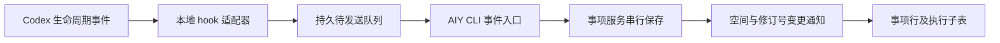

# Codex 执行回调到 AIY

状态：设计提案，尚未安装 hook 或实现事件接收命令。

目标是让 Codex 在任务开始和本轮结束时主动发送执行事实，AIY 更新同一份执行记录，并在关联事项的子表中显示。已移除按固定周期读取任务列表、为标题和链接创建文章的旧实现。原有文章和已补录的执行回报保留。

## 已有能力与缺口

- `work read`、`work list` 和 `work mutate` 已提供按空间授权的 CLI 入口。
- `recordExecution` 保存执行回报、来源、原会话链接和多事项关联；同一执行来源与外部标识可更新原记录，不自动改变需求状态。
- 事项表现在能展开查看已有执行回报及委派执行尝试，读取同一份事项快照。
- `recordExecution` 要求结果和事项快照修订号，不能直接接收尚无结果的启动事件；其 `sourceUpdatedAt` 也不足以保证并发 hook 的事件顺序。
- 当前界面通过初次加载、主动刷新和本地修改读取事项快照。CLI 写入还需要补齐按空间和修订号发送的变更通知，才能自动刷新已打开的子表。

## 采用 Codex 生命周期 hooks

[官方 Hooks 文档](https://learn.chatgpt.com/docs/hooks)支持命令 hook，从标准输入接收 JSON；也支持调用已连接 MCP 服务的 hook。首版建议命令 hook 接本地 CLI，复用 AIY 的空间授权和后台服务。MCP 连接在 SessionStart 时可能尚未就绪，不适合作为唯一接收通道。

| 事件               | 提供的信息                                                        | 建议处理                                                                          |
| ------------------ | ----------------------------------------------------------------- | --------------------------------------------------------------------------------- |
| `SessionStart`     | `session_id`、`cwd`、`model`、`source`                            | 建立或恢复来源会话；`resume`、`compact` 不新增任务或执行                          |
| `UserPromptSubmit` | 会话字段、`turn_id`、`prompt`                                     | 建立本轮执行，标记运行中，保留用户目标；首次提交才形成可展示任务                  |
| `Stop`             | 会话字段、`turn_id`、`last_assistant_message`、`stop_hook_active` | 保存本轮回报；可能有其他 Stop hook 继续执行，不能仅据此认定运行最终结束或需求完成 |
| `Interrupt`        | 会话字段、`turn_id`                                               | 记录本轮被中断，不推断需求结果                                                    |
| `SessionEnd`       | 会话字段、`reason`                                                | 记录会话结束，不把关闭窗口或归档当成任务成功                                      |

这些事件不是覆盖桌面应用所有操作的全局 webhook。新建空白聊天是否触发 SessionStart、界面发起的每种会话是否采用相同 hook 配置，仍需按实际安装版本验证。第一版承诺的触发点应是“首次提交任务”，不能声称覆盖尚未执行的空聊天。

官方说明 hook 的 transcript 文件格式不稳定；方案不解析历史 rollout，也不读取其他会话。hook 的公共字段没有项目 ID，不能根据 `cwd` 推断项目：多个 Codex 项目可能共享目录。接收方须校验明确绑定的 Codex 项目 ID；必要时只查询本次会话的元数据。无法核实归属时进入待关联记录，不写入其他项目的需求。

## 建议的数据流

事件入口暂定 `aiy-agent work event --input -`，是待实现的提案命令。它和现有手动补录共用事项服务、权限校验及原子保存机制，不直接改用户数据库或插件状态文件。

接收协议需要明确以下字段：

- 协议版本、来源应用、连接/主机身份、绑定 ID 和固定目标空间 ID；不能跟随 AIY 当前打开的空间写入。
- 来源会话 ID、轮次 ID、事件类别及该轮事件顺序；有稳定事件 ID 时直接保存，没有时由适配器生成并在重试中复用。
- 用户提交的标题与正文、模型、最终回复和原任务链接分别保存；标题不代替指令或执行结果。
- 已确认的事项 ID 与关联依据。AIY 发起的任务直接沿用其来源身份；Codex 内直接新建的任务先进入未关联执行，不能仅凭标题相似自动建立需求。

以“来源应用 + 连接身份 + 会话 ID + 轮次 ID”识别一次执行。事件单独去重，重复上报不增加行或历史。发送时间不是可靠的排序依据；晚到的启动事件不能覆盖已处理的中断或结束事件。Stop 之后若继续同一轮，应允许有证据的恢复执行。无事件序号或明确终态时保留未知状态和原始事实，不猜测成功。

工作流状态与事项处理状态继续独立。`Stop` 带来的回复可以显示为“已回报”，是否成功、是否待用户确认要有明确来源；事项“已完成”仍需要验收依据。现有执行状态没有单独的“已回报”值，接入时须一起调整契约和中英文文案，不能把回调事件硬映射成 `SUCCEEDED`。

## 可靠交付与边界

hook 只校验并持久化当前事件，采用异步文件 I/O和短超时；传输由适配器处理，AIY 不可用时仍能保留待发送事件。后台 hook 可能被取消或乱序完成，因此关键事件不能只依赖内存队列。队列应限制单条大小、总字节数和保留期，并显示失败或容量不足；重试次数、退避和错误分类有明确上限。

发送重试只处理已经产生的事件，在新事件、AIY 就绪或用户重试时继续交付，不恢复全量或定时任务列表扫描。AIY 完成持久化后再确认接收。关联、重开或人工修正作为独立事实保存，不能被后来的外部状态覆盖。

首次接入先只绑定一个明确选择的 Codex 项目和一个 AIY 空间。真实 hook 配置需要用户在 Codex 中审核并信任；修改定义后还需要重新审核。不要写入信任存储或使用绕过信任的参数。安装 hook 不得默认扩展到其他项目或子代理。

## 实施与验证次序

1. 先补事件接收、来源身份、去重、排序与授权，再补完成持久化后的界面通知。
2. AIY 发起的任务在现有 `startThread` / `runTurn` 生命周期中使用同一事件入口，携带已知来源，不依赖模型记得调用工具。
3. Codex 直接发起的任务接入项目范围 hook；原生事件和 hook 使用同一执行身份，避免双写重复。
4. 安装前核对当前 Codex 版本及 hook 支持；在获得实际执行验证授权后，检查首次提交、续聊、恢复、压缩、中断、Stop 继续执行、多空间、离线恢复与重复送达。

当前改动只交付界面、便签指令标题和移除旧同步。本文列出的回调命令、队列和变更通知均未启用。
