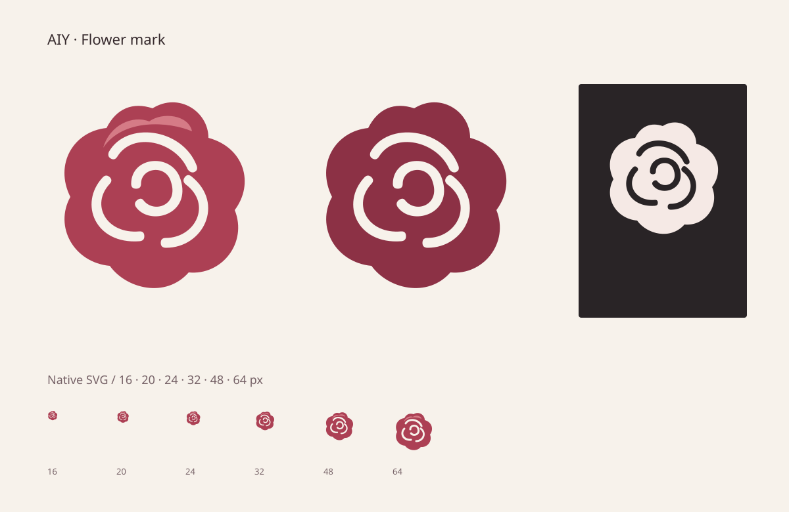

# AIY 花花标志

花花入口现在使用自己的俯视玫瑰标志。花冠保留宽圆的起伏，三道圆端负形表示向内叠合的花瓣，中央只留一片较大的卷瓣；小尺寸不再依赖细碎的轮廓或明暗纹理。



默认颜色为 `#ac4054`，上缘点缀 `#d57b86`。单色版继承 `currentColor`，可以用于文字色或反白。折线是透明的复合路径，换背景不需要修改底色。标志不含渐变、滤镜、外部字体、位图或 SVG ID。

## 使用

菜单和图标按钮使用 `src/renderer/components/brand/AIYFlowerMark.tsx`。默认尺寸为 24 px，可通过现有 `size-*` 工具类调整。与已有文字并排时默认对辅助技术隐藏；独立使用时从项目语言资源传入 `aria-label`。

```tsx
<AIYFlowerMark className="size-4" />
<AIYFlowerMark className="size-6" monochrome aria-label={messages.desktopPetals.flower.title} />
```

可导出的原生 SVG 位于 `src/renderer/assets/aiy-flower.svg` 和 `aiy-flower-monochrome.svg`，与组件共用相同轮廓。修改轮廓时应同时更新导出版。

`DesktopPetalsMenuAction` 的花花子菜单入口及“显示主花”使用同一标志；人物身份画、窗口图标、实际可摘花的造型和交互继续使用各自现有组件。

## 检查

- 两个 TSX 与本文通过项目 Prettier 配置检查，两个 TSX 通过项目 ESLint 规则。
- 对修改的两个 TSX 文件进行了 esbuild 转译检查。
- 标志组件单独通过 TypeScript 严格检查，使用 React 19 的 SVG 类型。
- 将 React 实际输出按 16、20、24、32、48、64 px 渲染，分别检查玫瑰红和单色，共 12 个尺寸样张；对照图按原尺寸展示小图标。
- 核对默认装饰图形和带名称图形的辅助技术属性，多实例无需生成 SVG ID。
- 64 px 的独立 SVG 与 React 组件逐像素一致。

以上为标志渲染和改动文件的检查。未在此环境运行完整 Electron 应用、全仓库类型检查或打包流程。
