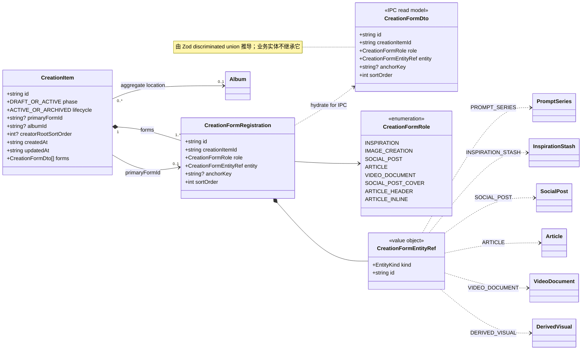
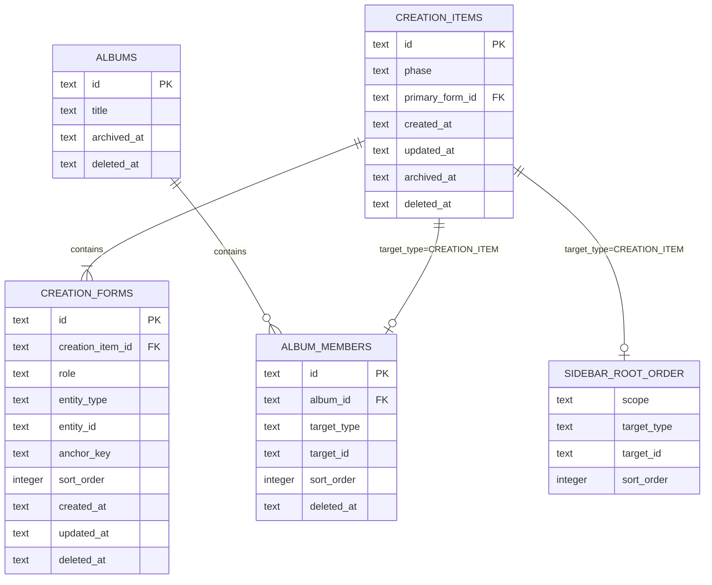
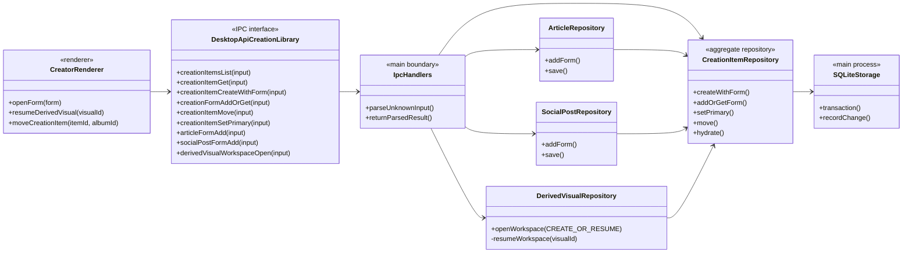
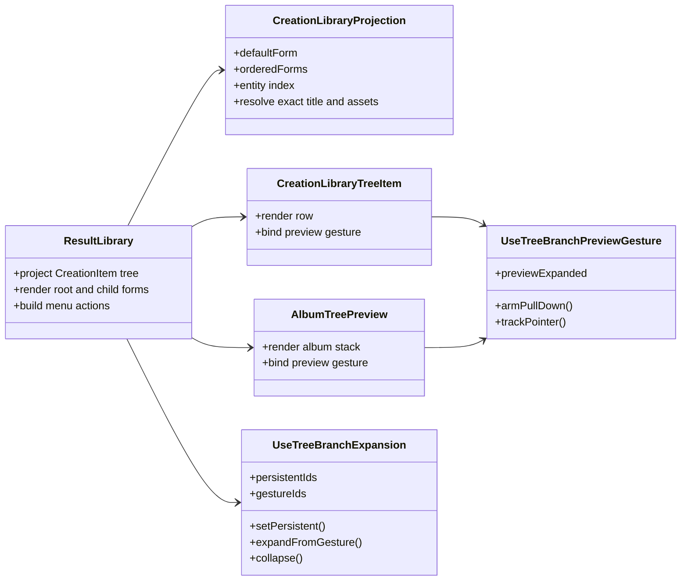
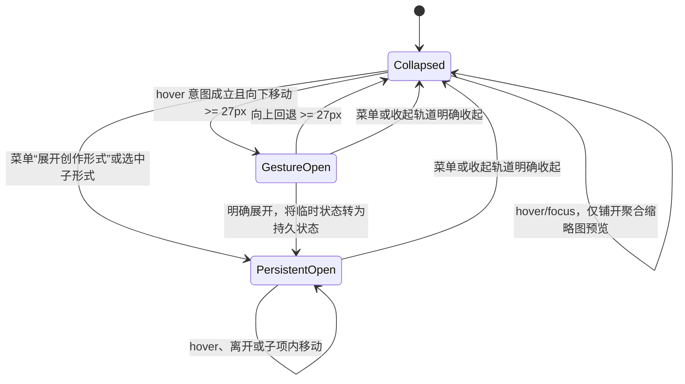
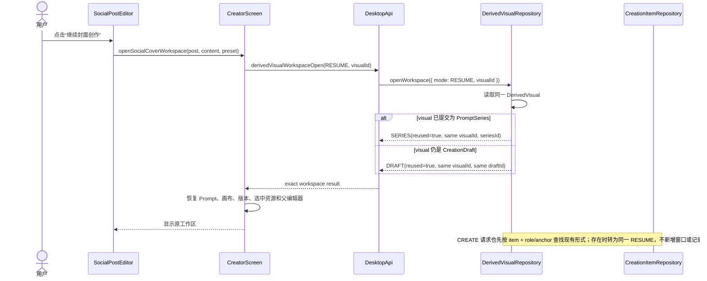
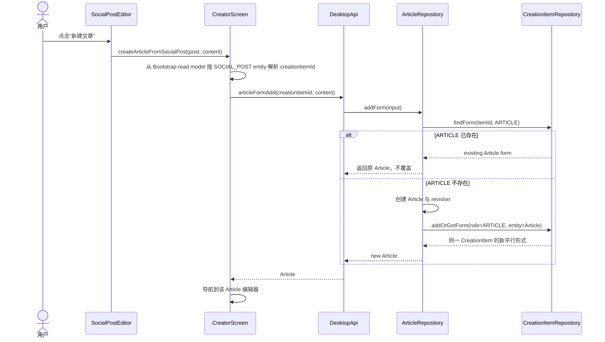
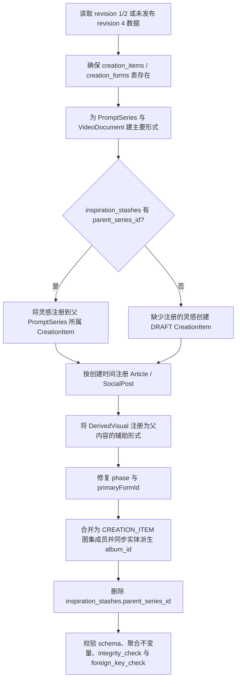

# 创作项、创作形式与侧栏交互设计

> 状态：As-is，已实现
> 适用版本：AIY Desktop 0.3.6
> 数据库版本：0.3.0 baseline / revision 4
> 更新日期：2026-08-25

本文记录创作侧栏的领域模型、对象与接口边界、持久化关系、交互状态和关键用户流程。文档描述当前实现，不把历史上的 `parentSeriesId`、按内容类型平铺侧栏或临时折叠布尔值保留为兼容概念。

## 1. 术语与边界

| 概念                       | 定义                                                                            | 不是什么                                         |
| -------------------------- | ------------------------------------------------------------------------------- | ------------------------------------------------ |
| `CreationItem`（创作项）   | 创作侧栏中的稳定聚合身份，拥有生命周期、图集位置和多个创作形式                  | 不是 PromptSeries 的别名，也不是某一种编辑器文档 |
| `CreationForm`（创作形式） | `CreationItem` 与一个强类型业务实体之间的角色化注册关系                         | 不是 Article、SocialPost 等实体的父类            |
| primary form（主要形式）   | `ACTIVE` 创作项对外首先展示和打开的创作形式                                     | 不是“第一个数组元素”，也不是当前选中的子项       |
| default form（默认形式）   | 点击创作项聚合行时默认打开的形式；活动项取 primary form，灵感草稿取唯一灵感形式 | 不是创作项聚合行，也不是新的持久化实体           |
| auxiliary form（辅助形式） | 封面、题图和正文配图等依附于主要内容的创作形式                                  | 不能成为主要形式                                 |
| `CreationFormDto`          | 由运行时 schema 推导、跨 IPC 返回的只读传输模型                                 | 不是数据库实体基类或可继承的领域对象             |
| exact resume（精确恢复）   | 使用稳定 `visualId` 恢复同一派生视觉、草稿/系列、Prompt、画布和选中资源         | 不是用父内容重新执行一次“创建”                   |

创作内容实体继续拥有各自的数据与版本规则：

- `PromptSeries`：图片创作及其 PromptVersion、GenerationRun；
- `InspirationStash`：灵感输入快照；
- `SocialPost`：社交贴文及不可变 revision；
- `Article`：文章及不可变 revision；
- `VideoDocument`：视频文档及其工作区；
- `DerivedVisual`：封面、题图、正文配图的精确工作区身份。

这些对象不继承 `CreationForm`。`CreationForm` 只通过 `{ kind, id }` 引用它们，使聚合关系与各实体自己的版本、校验和工作区状态解耦。

## 2. 领域对象 UML

### 2.1 角色分类

主要形式可以成为 `primaryFormId`：

- `IMAGE_CREATION`
- `SOCIAL_POST`
- `ARTICLE`
- `VIDEO_DOCUMENT`

非主要形式：

- `INSPIRATION`：允许作为尚无完成结果的 `DRAFT` 默认形式；
- `SOCIAL_POST_COVER`
- `ARTICLE_HEADER`
- `ARTICLE_INLINE`

`ARTICLE_INLINE` 可以按不同 `anchorKey` 重复；其他角色在同一创作项内是单例。

### 2.2 聚合不变量

1. 一个未删除的业务实体最多被一个未删除的 `CreationForm` 注册。
2. `DRAFT` 项没有 `primaryFormId`，只能包含灵感形式。
3. `ACTIVE` 项必须有主要形式，且 `primaryFormId` 必须指向本项内的主要形式。
4. 第一项加入 `DRAFT` 的完整结果自动成为 primary；之后新增平行形式不暗中替换 primary。
5. 封面、题图和正文配图不能创建独立顶层创作项。
6. 图集成员关系、归档/删除针对整个 `CreationItem`，不能只移动其中一个形式。
7. 同一单例角色再次请求时返回原实体，不创建副本，也不覆盖其内容。
8. 创作侧栏显示顺序由活动时间投影决定，不由成员或根节点的持久化顺序字段决定。

## 3. 持久化 UML

`creation_forms.entity_type/entity_id` 是受 Repository 和 runtime schema 校验的多态引用；普通同构关系继续使用 SQLite 外键。三个唯一索引保证：

- 活动实体注册唯一：`(entity_type, entity_id)`；
- 非正文配图角色唯一：`(creation_item_id, role)`；
- 正文配图锚点唯一：`(creation_item_id, role, anchor_key)`。

`album_members` 不再分别保存 PromptSeries、文章、贴文或灵感成员。它只保存 `CREATION_ITEM`，读取投影再沿 `creation_forms` 获取内容。为兼容具体编辑器的既有查询，灵感、文章和贴文表中的 `album_id` 是随聚合移动同步的派生位置，不能作为另一份独立归属修改。

`album_members.sort_order`、`sidebar_root_order` 和 `creatorRootSortOrder` 继续保留为持久化兼容数据，并供素材页等既有场景使用；创作侧栏不读取这些值决定展示优先级，也不因同一父级拖放改写展示顺序。

## 4. 对象与接口分层 UML

### 4.1 `CreationFormDto` 命名规则

`CreationFormDto` 的 `Dto` 后缀只在传输/read-model 语义下使用，当前写法符合以下边界：

- 类型由 `creationFormSchema` 推导，不手写一份可能漂移的全可选接口；
- DTO 是按 `role` 区分的 discriminated union；
- 数据库行先验证并映射为 DTO，Renderer 再投影成具体视图对象；
- `Article`、`SocialPost`、`PromptSeries` 等实体不 `extends CreationFormDto`；
- 命令使用 `...Input`，返回使用 `...Result`，持久化内部记录不滥用 `Dto` 后缀。

如果未来出现只在领域层使用、不会跨边界的行为对象，应使用领域名称或 value object 名称，而不是继续增加 `...Dto`。

## 5. 侧栏投影与组件 UML

投影规则：

1. 侧栏根行始终代表 `CreationItem` 聚合，不携带或伪装成任何 `CreationForm`。
2. `ACTIVE` 项使用 `primaryFormId` 指向的形式作为 `defaultForm`；`DRAFT` 灵感项使用唯一灵感形式作为 `defaultForm`。
3. 一个创作项存在多个可见形式时，所有形式（包括 primary form）作为聚合行下的同级子项呈现；封面等辅助形式不能成为另一棵顶层创作。
4. 形式默认收起；如果当前路由精确选中了非默认形式，则所属创作项持久展开。
5. 拖放载荷只传 `creationItemId`，不允许按 article/post/stash 分别拖动。
6. 同一图片创作会话中的方向/实验成员系列只投影一个规范根行；成员系列保留精确恢复别名，不能按标题去重。

### 5.1 固定排序与活动时间

根节点、每个图集内部以及搜索或筛选后的同级结果都使用同一个稳定比较器：

1. 置顶图集在前；创作项不能置顶。
2. `activityAt` 倒序。
3. `createdAt` 倒序。
4. 类型与稳定 ID 组成的键升序，保证时间相同时结果稳定。

`CreationItemProjection.activityAt` 是聚合项、所有创作形式实体、Prompt 版本、导入/变换结果以及生成任务完成时间的最大值。`AlbumDto.activityAt` 是图集自身内容、直接成员、子图集与所有后代创作项的递归最大值。

新建、保存、改名、生成完成、导入、封面或产出调整以及跨父级移动属于实际内容活动，会提升创作项及祖先图集；仅打开、选中、展开、置顶或取消置顶不改变活动时间。拖放只负责跨图集或根层级移动，同一父级拖放不重排。

## 6. 展开交互状态 UML

这里有三个不能混用的状态：

- `previewExpanded`：只控制缩略图堆叠动画；
- `gestureIds`：下拉手势产生的临时展开；
- `persistentIds`：菜单、选中子项等明确操作产生的持久展开。

### 6.1 命名防混淆

| 名称                             | 用户文案                | 作用域                           | 禁止混用为             |
| -------------------------------- | ----------------------- | -------------------------------- | ---------------------- |
| `collapseFollowingItems`         | 收起后续项目            | 从当前位置隐藏同级列表的后续项目 | 创作项子形式折叠       |
| `setPersistent(branchId, false)` | 收起创作形式 / 收起图集 | 明确收起一个树分支               | 预览动画状态           |
| `previewExpanded`                | 无独立按钮文案          | hover/focus 时铺开缩略图堆叠     | 子形式是否渲染         |
| `gestureIds`                     | 无独立按钮文案          | 下拉/上滑产生的临时分支状态      | 用户明确选择的持久状态 |

新增状态或回调必须带所有者名，例如 `itemExpansion`、`albumExpansion`、`previewExpanded`。禁止重新引入脱离上下文的 `collapsed`、`expanded`、`toggleCollapse` 来同时表达列表截断、树分支和媒体预览。

用户可见规则：

| 输入           | 结果                               | 明确禁止                        |
| -------------- | ---------------------------------- | ------------------------------- |
| hover 聚合行   | 缩略图平滑铺开                     | hover 直接展开子项              |
| 停留后向下滑动 | 临时展开子形式                     | 在根行右侧增加实体 chevron 按钮 |
| 向上回退       | 收起手势展开的子形式               | pointer leave 立即突兀收起      |
| 更多菜单       | 显示“展开创作形式”或“收起创作形式” | 菜单动作被手势锁拦截            |
| 收起轨道       | 明确收起                           | 只改变图标、不改变内容          |

### 6.2 动画分层与时序

展开交互分为三个互不代替的运动层：

1. 缩略图预览仅改变各帧的 `transform`，使用 `120ms`；它不挂载形式列表。
2. 分支内容由 Radix 测量实际高度，展开使用 `220ms`、收起使用 `180ms`。React 始终把内容交给 `CollapsibleContent`，收起时由 Radix 在离场动画结束后卸载，禁止用 `expanded && ...` 提前移除。
3. 只有分支超出滚动视口时才自动补偿滚动；在 `230ms` 后测量最终高度，使滚动紧接展开完成，而不是延迟成为第二段独立位移。

`prefers-reduced-motion` 下跳过分支高度动画。缩略图、分支和滚动分别拥有状态与时序，不能再用一个通用 `expanded` 条件同时控制三者。

树展开属于瞬时 UI 状态，不进入应用前进/后退历史。

## 7. “继续封面创作”时序 UML

## 8. 平行新建文章时序 UML

从灵感新建第一项完整结果时流程相同，但 `CreationItem.phase` 会从 `DRAFT` 变为 `ACTIVE`，新形式成为 primary。活动项从社交帖转换文章或从文章转换社交帖时只增加平行形式，不自动改变既有 primary。

## 9. revision 4 迁移 UML

迁移使用稳定、可重复的 ID；初始化重复执行不得产生第二个创作项或创作形式。派生视觉使用的内部 PromptSeries 不再注册为独立顶层 `IMAGE_CREATION`。

## 10. 验收与回归边界

必须保持：

- 有子形式的创作项首次出现时默认收起；
- 根行右侧没有专用展开/收起实体按钮；
- hover 后只有预览铺开，向下拉动才展开，向上回退可收起；
- 菜单明确收起可以覆盖任何临时手势状态；
- 子形式点击打开精确实体，父形式点击回到父编辑器；
- “继续封面创作”前后 `visualId` 不变，派生视觉记录数不增加；
- “新建文章”在同一 `CreationItem` 增加或打开 `ARTICLE`，不产生第二个创作项；
- 聚合移动后灵感、文章和贴文的派生 `album_id` 与 `CreationItem` 一致；
- 根节点、嵌套图集和搜索/筛选结果统一按“置顶图集、最近实际修改”稳定排序；
- 置顶切换、打开和选中不会改变内容活动时间，同一父级拖放不会手动重排；
- 旧 `parent_series_id` 迁移后列不存在，关系由 `creation_forms` 表达。

公开仓只保留通用 smoke lane；本文记录产品契约，不包含详细测试实现或运行证据。

## 11. 源码依据

- [CreationItem / CreationForm runtime contracts](../../src/shared/contracts/creation-library.ts)
- [CreationItem repository](../../src/main/database/creations/creation-item-repository.ts)
- [revision 4 composition migration](../../src/main/database/creations/creation-composition-schema.ts)
- [DerivedVisual exact resume](../../src/main/database/creations/derived-visual-repository.ts)
- [CreatorScreen workflow orchestration](../../src/renderer/components/CreatorScreen.tsx)
- [Creator library projection](../../src/renderer/components/creator/creationLibraryProjection.ts)
- [Creator sidebar](../../src/renderer/components/creator/ResultLibrary.tsx)
- [Shared expansion state](../../src/renderer/components/albums/useTreeBranchExpansion.ts)
- [Shared preview gesture](../../src/renderer/components/albums/useTreeBranchPreviewGesture.ts)
- [Gesture thresholds](../../src/renderer/components/albums/treeBranchInteraction.ts)
