# Desktop 当前架构与用户场景

> 状态：As-is
> 范围：`apps/desktop/src` 及与当前产品行为直接相关的运行时、数据库结构
> 更新日期：2026-08-11

本文使用用例图、包/组件图、部署图、类图、时序图和状态图梳理 Desktop 当前结构。内容以源码为准，不引用 `trash/` 或未重新构建的 `release/` 产物。

## 1. 总体结论

Desktop 是本地优先的 Electron AI 图像创作与素材管理工作台：

- 本地空间（Local Space）是数据、后台任务和扩展状态的隔离边界。
- Renderer 负责界面和短暂交互状态，不直接访问文件系统、SQLite 或任意命令。
- Preload 只暴露类型化 `DesktopApi`。
- Main 负责窗口、托盘、空间切换、受信 IPC、文件能力、连接配置和服务编排。
- 每个本地空间拥有独立 SQLite、SHA-256 对象库和 Model Worker。
- Model Worker 承载图片生成、Assistant、字典大批量处理及可恢复后台任务。
- 核心业务链为 `CreationDraft → PromptSeries → PromptVersion → GenerationRun → ImageAsset/Material`。

## 2. 用户与系统用例图

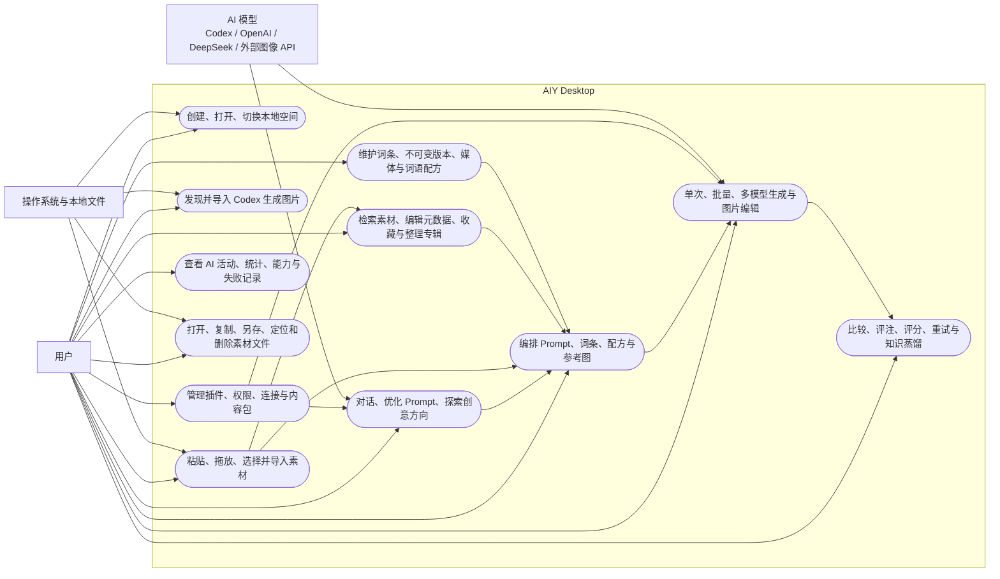

当前主导航：

| 入口       | AppView       | 主要职责                                       |
| ---------- | ------------- | ---------------------------------------------- |
| 创作台     | `creator`     | Prompt 编排、生成、比较、Assistant 与结果管理  |
| 词典       | `dictionary`  | 搜索、编辑、核准、归档、导入、媒体和维护报告   |
| 素材库     | `gallery`     | 检索、筛选、专辑、评分、收藏、元数据和文件动作 |
| Codex 图片 | `codexImages` | 扫描 Codex 本地图片并导入为创作成果            |
| 扩展       | `packs`       | 插件、权限、Provider 连接与内容包              |
| AI 中心    | `aiCenter`    | AI 活动、统计、能力配置、定位和重试            |

空资料库进入创作台时显示 `LibraryStartScreen`，并在该界面本次挂载时自动打开一次入门素材确认框。只有用户确认后才导入内置素材包；选择保持空空间不会写入数据。投放图片、导入其他内容包和打开其他本地空间仍是并列入口。

### 2.1 空空间与默认素材包导入指引

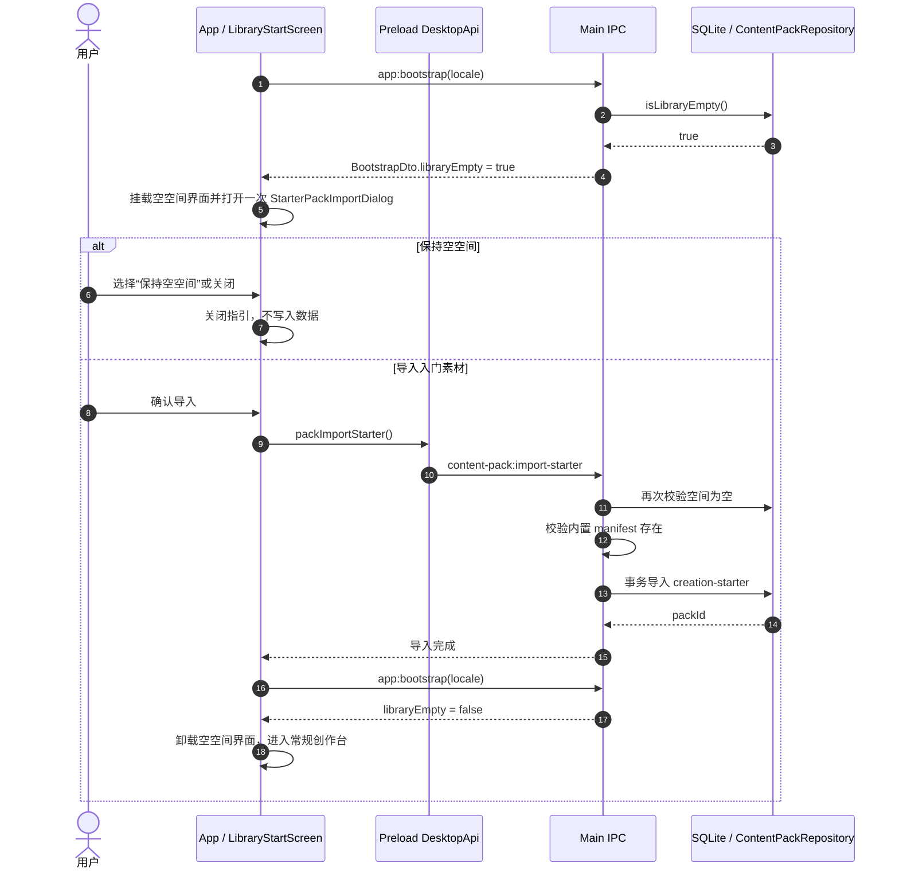

Main 初始化空间时不再静默播种，也不吞掉入门包导入错误。专用 IPC 不接受 Renderer 提供的文件路径，只能导入应用内置的 `creation-starter`；执行时的二次空空间校验负责防止界面状态过期。通用“导入内容包”仍通过目录选择器处理用户指定的包。

## 3. 源码包与组件结构

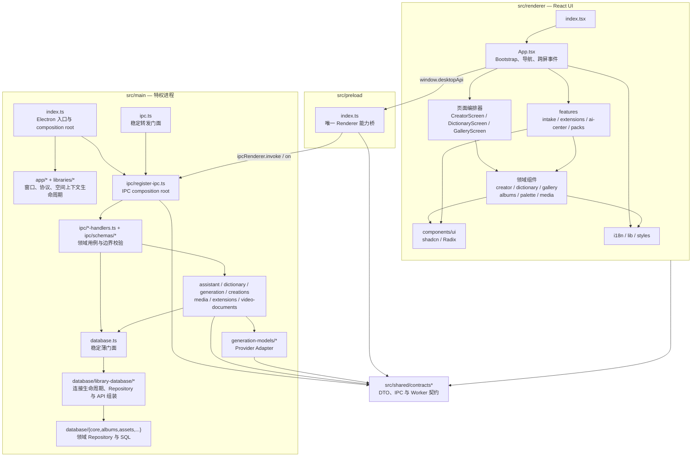

### 3.1 Renderer

- `App.tsx` 保存全局位置、Bootstrap 快照、空间切换状态和跨屏跳转。
- 三个主要 Screen 是页面编排器，领域能力继续下沉到子组件。
- `features/intake`、`extensions`、`ai-center`、`packs` 是独立功能域。
- 页面首次访问时懒加载；访问后保持挂载并通过隐藏切换，以保留局部状态。

### 3.2 Main

- `main/index.ts`：Electron 入口和最终 composition root；窗口/托盘状态、Renderer 事件、媒体响应与空间 Context 的实现分别位于 `app/*` 和 `libraries/*`。
- `main/database.ts`、`main/ipc.ts`、`main/generation.ts`、`main/codex.ts` 等根文件是稳定转发门面，不承载业务行为。已有调用方可以继续使用稳定入口，新 Main 内部代码使用直接 `@/main/...` 路径。
- `main/ipc/register-ipc.ts`：只组合可信 IPC registrar、领域 handler 和所需服务；`ipc/*-handlers.ts` 按用例域注册 channel，`ipc/schemas/*` 保存可复用的运行时输入 schema。
- `main/database/library-database/*`：实现 `LibraryDatabase` 的连接生命周期、Repository 构造和按领域分组的委托 API；`main/database.ts` 只导出这个稳定门面。
- `main/database/{core,albums,assets,assistant,creations,dictionary,extensions,generation,packs,video-documents}`：领域查询、事务、Revision、Change Event 和对象存储行为；固定多语句 SQL 位于 `database/sql/*`。
- `main/generation/*`：生成排队、并发、执行快照、结果提交与取消；`main/assistant/*`：Assistant 与 Codex 运行时；`main/media/*`：受控本地媒体能力。
- `main/model-worker/*`：每空间后台进程的发现、握手、RPC、升级和空闲退出。
- `main/app/renderer-event-dispatcher.ts`：维护可替换 Renderer frame 的就绪边界，统一安全发送 Main → Renderer 事件，并在销毁/重载期间丢弃瞬态事件。

数据库目录的归属规则如下：

| 目录                               | 归属                                                              |
| ---------------------------------- | ----------------------------------------------------------------- |
| `database/core`                    | SQLite 连接、schema、基础值和批处理原语                           |
| `database/library-database`        | 稳定 `LibraryDatabase` 的生命周期、Repository 构造和领域 API 组合 |
| `database/albums`、`assets`        | 专辑关系、素材、图库和文件视图投影                                |
| `database/creations`、`dictionary` | 创作导入/暂存、词条、分类、词板和知识维护                         |
| `database/assistant`、`generation` | Assistant/AI 过程、生成作业、快照和工作台                         |
| `database/extensions`、`packs`     | 扩展发现与内容包安装/对账                                         |
| `database/video-documents`         | 视频文档及其导航、生成运行记录                                    |
| `database/sql`                     | 命名的固定多语句 SQL、baseline 与 revision                        |

新增代码遵循四条结构约束：根门面只能转发；跨领域组装只进入 composition 模块；业务行为进入最具体的领域目录；不得为缩短路径新增 barrel。兼容旧测试或外部调用所需的一行转发文件可以保留，但不能再次长成实现文件。

## 4. 运行时组件与部署图

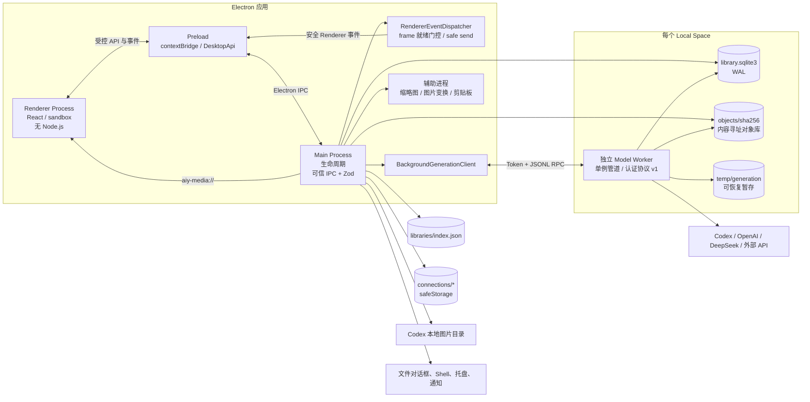

安全边界：

- BrowserWindow 开启 `contextIsolation`、`sandbox`，关闭 `nodeIntegration`。
- Main 验证 IPC sender/main frame，并通过 Zod 校验输入。
- 页面导航、新窗口和浏览器权限默认拒绝。
- Worker 使用每空间固定端点和随机令牌握手。
- API 密钥由 Main 加密保存，只把内存运行时配置传给 Worker。
- Renderer 通过 `aiy-media://` 读取授权媒体，不接触真实磁盘路径。

## 5. 核心创作与素材领域类图

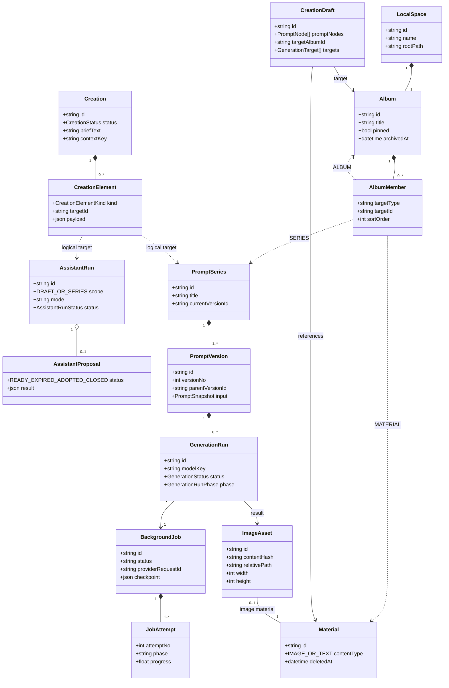

两个重要的多态关系：

- `album_members.target_type/target_id` 可以指向素材、Prompt 系列或子专辑。
- `creation_elements.kind/target_id` 将 Assistant、Prompt 系列、探索批次等纳入同一个 Creation 聚合。

SQLite 运行时关闭外键强制检查。关系主要由 Repository 显式验证，读取路径允许软引用缺失；因此上图表示业务关系，不都表示数据库强外键。

## 6. 词典、词语配方与内容包类图

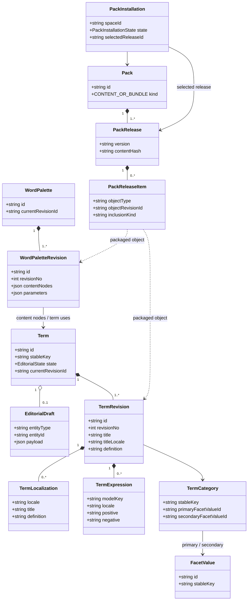

词条与词语配方都使用稳定实体 ID 加不可变 Revision。编辑内容先进入 Draft；只有核准时才创建新的 `TermRevision` 并切换 `current_revision_id`。

## 7. 图片生成主场景时序图

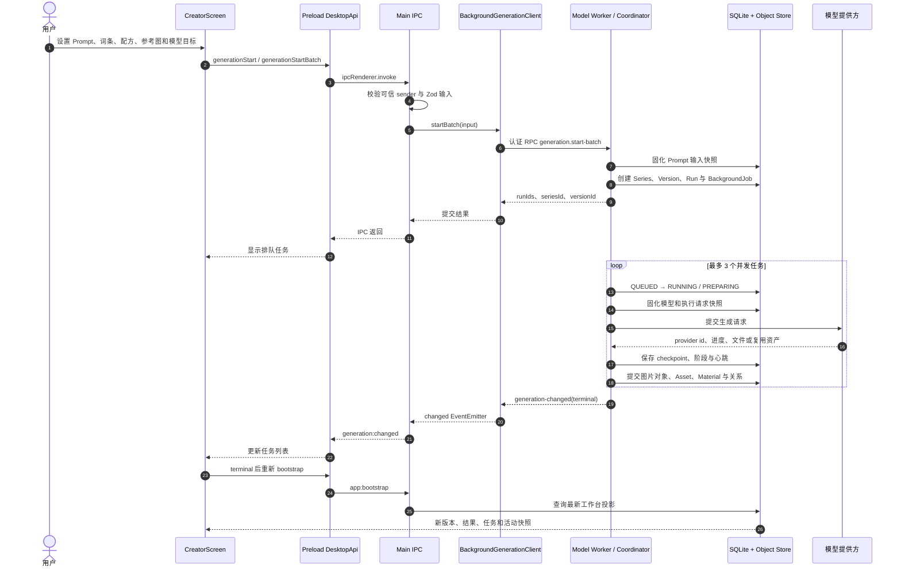

生成前会固化 Prompt、词条/配方引用、模型描述和执行请求，保证重试不会隐式改用当前编辑器状态。

### 7.1 Renderer 重载期间的安全事件分发（修改后）

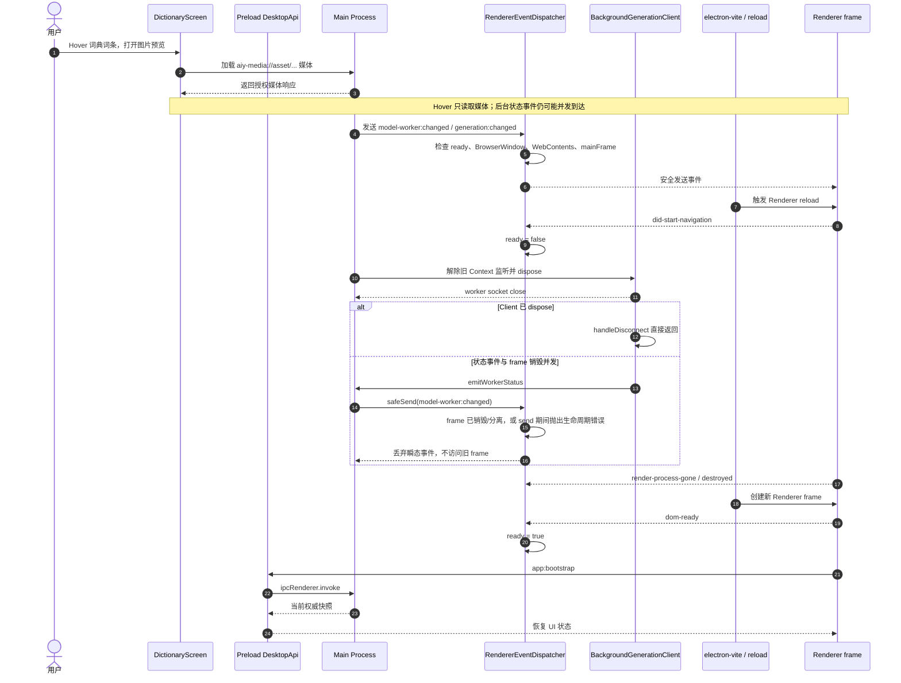

修改后，所有 Main → Renderer 的推送都经过 `RendererEventDispatcher`。Renderer 导航、崩溃或销毁期间只丢弃瞬态事件；新 frame 在 `dom-ready` 后通过 `app:bootstrap` 获取权威快照。`BackgroundGenerationClient.handleDisconnect` 在客户端已释放时直接返回，避免在 teardown 竞态中再次广播状态。

## 8. 本地空间切换时序图

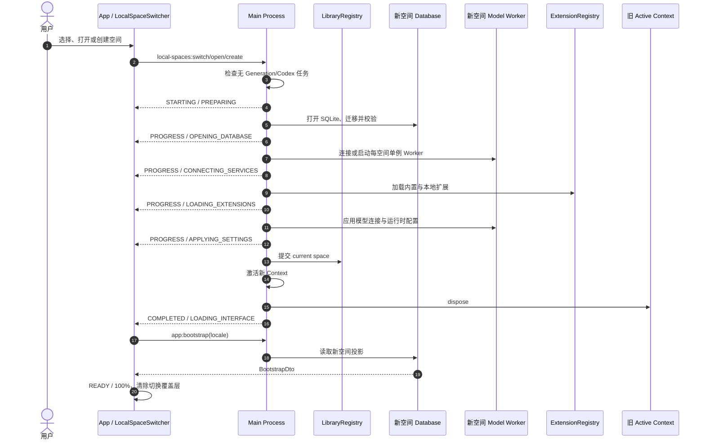

新 Context 在数据库、Worker 和扩展全部就绪前不会替换旧 Context；失败时旧空间继续可用。

## 9. 生成任务状态图

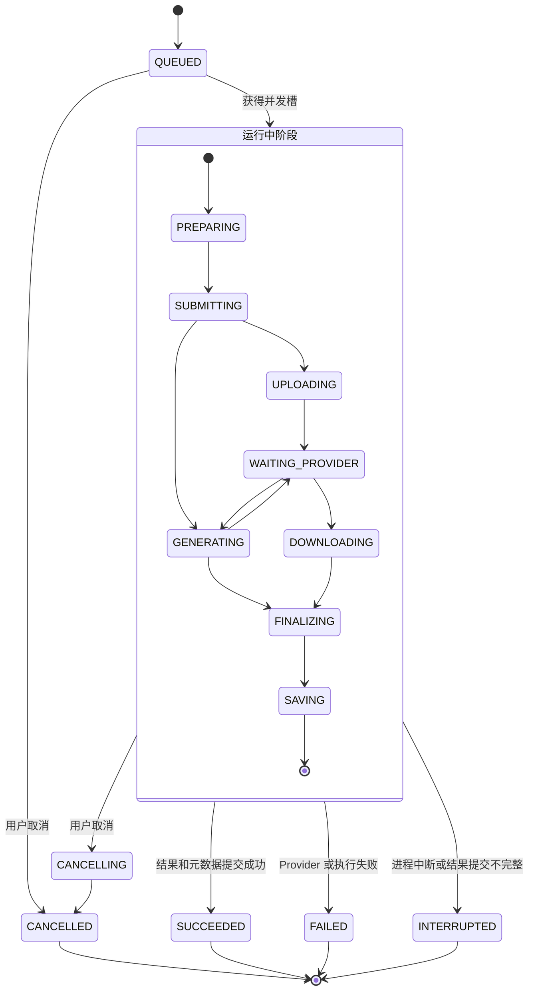

Provider 已返回文件但本地提交失败时记为 `INTERRUPTED`，并保留暂存目录供恢复，而不是误记为普通生成失败。

## 10. 词条编辑状态图

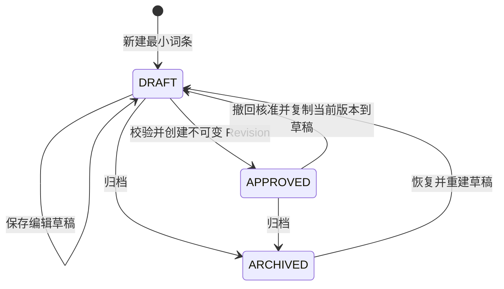

核准要求至少具备定义、分类和一个正向模型表达；核准后 Draft 被删除，历史 Revision 保留。

## 11. 当前结构性热点

以下位置变更影响面较大，但不代表当前存在功能故障：

| 位置                                            | 当前职责                                                  |
| ----------------------------------------------- | --------------------------------------------------------- |
| `renderer/components/CreatorScreen.tsx`         | 创作会话、Prompt、Assistant、生成、比较和多类弹窗的总编排 |
| `renderer/components/creator/ResultLibrary.tsx` | 结果树、输出集合、选择和创作历史                          |
| `renderer/components/GalleryScreen.tsx`         | 素材查询、分页缓存、专辑、选择和检查器编排                |
| `main/index.ts`                                 | Electron 入口、协议安装和最终 Context/IPC 组装            |
| `shared/contracts.ts`                           | Renderer、Preload、Main 和 Worker 的共享协议              |

原 `main/ipc.ts`、`main/database.ts`、`main/generation.ts` 和 `main/codex.ts` 已降为稳定薄门面；原先超过千行的数据库聚合、工作台、文件视图、内容包、Codex 和生成协调实现也已经拆入对应领域模块。后续评审应查看具体领域文件，而不是把根门面当作行为入口。

后续演进应继续保持：

- 页面只编排数据和状态，局部能力下沉到领域组件。
- `database.ts` 只做生命周期、委托和必要的跨 Repository 事务。
- IPC 输入在 Main 校验，Renderer 不获得额外特权。
- 长任务继续由 Worker 承担，避免在 Main 或列表渲染路径中执行重 I/O。
- `0.3.0` 是第一次正式发布的 baseline；正式发布前允许把预发布迁移继续重整进 `v03-baseline.sql`，不为旧开发库保留兼容分支。`0.3.0` 发布后冻结 baseline，此后迁移保持前向递增，且不修改任何已经随正式版本发布的迁移。
- 网络、文件、Worker 和扩展数据先作为 `unknown` 进入 runtime schema，再成为推导出的领域类型；禁止用 assertion 把外部数据直接伪装成 DTO。
- 跨 `await` 的操作固定一个 LibraryContext；空间切换和退出先 drain/cancel 后台工作，再关闭数据库。

## 12. 主要源码依据

- [Renderer 应用编排](../../src/renderer/App.tsx)
- [应用导航模型](../../src/renderer/components/app/app-navigation.ts)
- [Main 入口与本地空间 Context](../../src/main/index.ts)
- [Main 应用壳](../../src/main/app/application-shell.ts)
- [Active Library Context](../../src/main/libraries/active-library-context.ts)
- [Preload DesktopApi](../../src/preload/index.ts)
- [IPC 组合根与 Bootstrap](../../src/main/ipc/register-ipc.ts)
- [Database 门面](../../src/main/database.ts)
- [Database 实现与生命周期](../../src/main/database/library-database/library-database.ts)
- [对象存储与 Change Event](../../src/main/database/core/storage.ts)
- [生成协调器](../../src/main/generation/coordinator.ts)
- [Renderer 事件分发器](../../src/main/app/renderer-event-dispatcher.ts)
- [Model Worker 协议](../../src/main/model-worker/protocol.ts)
- [Model Worker 客户端](../../src/main/model-worker/client.ts)
- [Model Worker 服务端](../../src/main/model-worker/server.ts)
- [词条状态与 Revision](../../src/main/database/dictionary/dictionary-repository.ts)
- [当前数据库基线](../../src/main/database/sql/v03-baseline.sql)
- [词条本地化与分类基线](../../src/main/database/sql/v03-baseline.sql)
- [窗口安全策略](../../src/main/app/window-security.ts)
