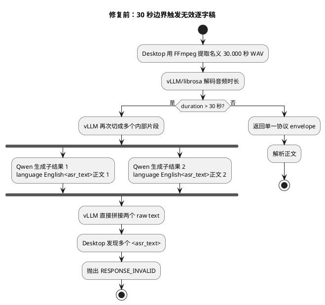
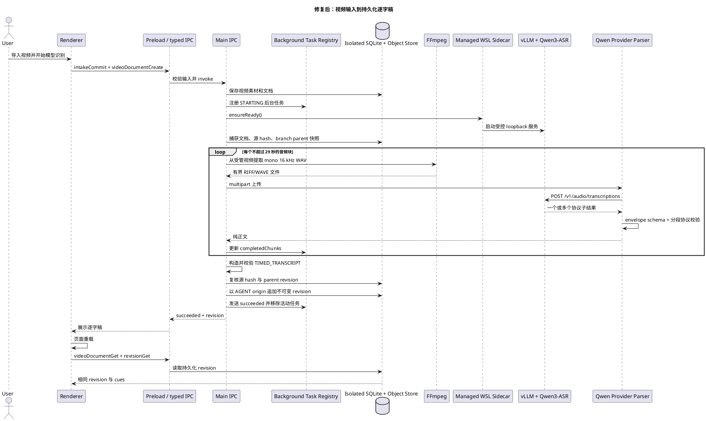

# 本地 Qwen ASR 无效逐字稿故障分析

状态：已定位并修复
日期：2026-08-12

## 1. 现象

对 9 分 52 秒视频执行本地模型识别时，后台任务终止，Renderer 显示“本地模型返回了无效的逐字稿”。该文案只对应统一错误码 `RESPONSE_INVALID`，不能区分 HTTP envelope、Qwen 协议和最终 `TIMED_TRANSCRIPT` schema。

## 2. 逐层排查结果

| 层次                      | 结果         | 证据                                                              |
| ------------------------- | ------------ | ----------------------------------------------------------------- |
| 视频源与音轨              | 正常         | 源视频 592,012 ms，单音轨，状态 `HAS_AUDIO`                       |
| FFmpeg 提取               | 正常         | 第一个名义 30 秒 WAV 为 960,092 bytes，RIFF/WAVE 校验通过         |
| WSL Sidecar               | 正常         | `/v1/audio/transcriptions` 返回 HTTP 200、JSON 和 duration usage  |
| 模型正文                  | 正常         | 两个子片段都有可用英文转录正文                                    |
| Qwen/vLLM 协议            | 发生二次分片 | 同一 HTTP `text` 中出现两个 `language English<asr_text>` envelope |
| Desktop Provider          | 错误拒绝     | 旧实现规定 `<asr_text>` 只能出现一次，因此抛出 `RESPONSE_INVALID` |
| `TIMED_TRANSCRIPT` schema | 未执行       | 错误发生在 Provider 解析阶段，尚未构造 cue 或 revision            |

实际响应形状被安全缩写为：

```text
language English<asr_text>...the mathematician.
language English<asr_text>Perspective.
```

这不是模型返回了空文本，也不是逐字稿 schema 无效，而是 Desktop 对合法的多子结果响应做了错误假设。

## 3. 根本原因

Qwen3-ASR-0.6B 的 `preprocessor_config.json` 声明 `chunk_length: 30`。qwen-asr 0.0.6 注册给 vLLM 的 `SpeechToTextConfig.max_audio_clip_s` 因此也是 30 秒。

Desktop 同样把源音轨按 30,000 ms 提取。受容器时间基、重采样和采样点取整影响，名义 30 秒 WAV 被 vLLM 解码为略大于 30 秒；本次返回的 duration usage 向上取整为 31 秒。vLLM 在 `duration > max_audio_clip_s` 时再次切块，并把每个生成结果的原始 `text` 直接连接。Qwen 的每个生成结果都含自己的 `language …<asr_text>` 前缀，因此最终 HTTP envelope 中出现重复协议头。

旧 Provider 将第二个协议头视为恶意或畸形控制标记，导致稳定复现的 `RESPONSE_INVALID`。



## 4. 修复策略

修复同时处理诱因和协议兼容，不能只做字符串替换：

1. Desktop 音频分块从 30,000 ms 调整为 29,000 ms，给 vLLM 的 30 秒阈值保留一秒余量；
2. Provider 将多个 `language …<asr_text>` 视为有界的合法子结果，逐段验证 language、正文和控制令牌，再以换行合并正文；
3. 最多接受 64 个协议子结果，未知标记、不匹配标记和控制令牌泄漏仍然 fail closed；
4. 继续支持 qwen-asr 官方解析器允许的多行 metadata、纯文本输出和 `language None` 空音频；
5. Main 在失败时记录 bounded 的 operation、document、错误码和安全 diagnostic，不记录 API token、路径、完整模型正文或 WAV；
6. 最终结果仍必须通过 `videoDocumentTimedTranscriptContentSchema`，并在提交前复核源素材 hash 和 parent revision。

29 秒真实请求返回一个协议标记，证明边界余量消除了本次二次分片诱因；多段解析则防止将来服务端自行分片时再次失败。

## 5. 修复后的端到端时序



## 6. 回归验证边界

回归契约覆盖真实 loopback HTTP、multipart WAV、Bearer header、JSON envelope、多段 Qwen 协议正文，以及完整视频输入经过 FFmpeg、受管 WSL/Qwen、逐字稿 revision 提交和重新读取的链路。硬件场景必须显式提供合成语音视频，不在普通 CI 中隐式下载权重、读取用户素材或调用付费 Provider。

公开仓库只保留本故障的原因、修复策略和验收契约，不保存详细测试实现、夹具、trace 或失败证据。

统一创作入口、后台任务和后续图文稿编排见 [视频文档统一创作与后台转录工作流](video-document-creation-workflow.md)。
