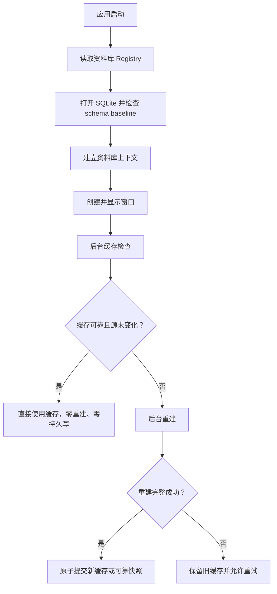

# 启动缓存与文件 I/O

## 决策

启动采用“缓存优先、变化驱动、无变化零写入”的策略：

- 有可靠缓存时直接加载缓存，只执行足以判断缓存是否失效的轻量检查。
- 只有检测到源变化、缓存缺失或用户明确要求刷新时，才重建派生数据。
- 重建必须完整成功后才能提交新的可靠快照；失败或不完整结果不得覆盖旧缓存。
- 非关键缓存维护在窗口显示后执行，并且失败只能影响对应功能，不能导致主进程退出。
- 相同输入不得重复写 Registry、预览文件或 SQLite discovery 行。

该策略优先优化稳定资料库的日常启动；首次使用、新资料库和真实源变化允许承担一次必要的重建成本。

## 启动分层

窗口显示前只保留核心资料库可用性所需的工作。图片发现、空间预览生成等派生任务在窗口显示后错峰执行，避免与首屏渲染争用磁盘和 SQLite。

## 缓存契约

### 可靠快照

可靠快照至少包含：

- 缓存格式版本；
- 对应源路径；
- 上次完整扫描时间；
- 足以判断源是否变化的元数据；
- 派生文件与源项目之间的稳定映射。

只有完整扫描前后的源快照一致时，扫描结果才可以成为新的可靠快照。扫描过程中目录变化、文件消失或读取失败时，只能返回临时结果，不能推进持久快照。

### 失效条件

缓存仅在以下情况失效：

1. 没有可靠快照或缓存文件缺失；
2. 缓存格式版本变化；
3. 缓存记录的源路径发生变化；
4. 轻量源快照检测到新增、删除或修改；
5. 运行时 watcher 检测到变化；
6. 用户明确执行刷新。

用户明确刷新可以采用更严格的校验，例如重新计算文件内容哈希。

### 无变化零写入

缓存命中时不得为了更新时间、scan ID 或“确认仍然存在”而回写全部记录。时间戳只描述真实扫描或真实变化，不能成为每次启动强迫写入的理由。

## 当前实现

### 资料库 Registry

[library-registry.ts](../../src/main/libraries/library-registry.ts) 在 primary JSON 结构有效且序列化文本完全相同时直接返回，不创建临时文件、备份或执行 `fsync`。只有缺失、损坏或内容真实变化时，才继续使用 recoverable atomic write。

这保留了原有备份和断电恢复能力，同时消除了稳定启动固定产生的写放大。

### 空间预览

[index.ts](../../src/main/index.ts) 为每个空间保存预览 manifest，源指纹由绝对路径、文件大小和 mtime 组成。

- manifest 与输出 JPEG 完整命中时直接复用；
- 只重建发生变化的槽位；
- 缩略图生成失败时不提交新 manifest；
- 预览目录不可写时记录警告并降级，不中断应用；
- 初始预览刷新在窗口显示后执行。

### Codex 图片发现

[codex-image-discovery/index.ts](../../src/main/extensions/codex-image-discovery/index.ts) 启动时优先读取 SQLite 中的可靠扫描快照。缓存命中时仅：

- `readdir` 图片根目录；
- `lstat` 各线程目录本身；
- 根据缓存线程 ID 建立 watcher。

该路径不枚举、不 `stat`、不读取图片文件。只有缓存为空、线程目录集合或 mtime 变化、watcher 事件或用户明确刷新时才执行完整扫描。

[codex-image-discovery-repository.ts](../../src/main/database/codex-image-discovery-repository.ts) 在同一事务中保存 `last_scanned_at` 和线程目录快照。未变化且未恢复的 discovery 行不执行 UPDATE；缺失、恢复、内容变化和导入关联失效仍保持原有语义。

Codex 生成图片按追加式来源处理。软件关闭期间若已有图片被原地覆盖，而父目录 mtime 未变化，启动不会主动触碰全部图片来发现该情况；用户显式刷新会重新计算哈希。该取舍避免稳定启动退化为对全部历史图片逐一 `stat`。

### 后台模型 Worker

[client.ts](../../src/main/model-worker/client.ts) 缓存 Worker bundle 指纹。文件路径及 size、mtime、ctime、设备和 inode 未变化时只执行 `stat`，不重新读取整个 bundle。

Worker readiness 使用目录 watcher 等待 descriptor/error 原子发布，250ms 至 2s 的指数退避只作为漏事件兜底；正常启动不再以 100ms 周期读取状态文件。子进程提前退出且不存在 singleton winner 时立即失败，不等待完整超时。

[schema.ts](../../src/main/database/schema.ts) 将 schema/baseline 兼容门禁与完整一致性检查分开。主进程仍负责完整检查，Worker 只复核 baseline、revision 和关键表，避免同一资料库在一次启动中被完整扫描两次。

### 首发候选数据库基线

AIY 0.3.0 已确定为第一次正式发布的数据库 baseline，但尚未正式发布。当前数据库从单一 [v03-baseline.sql](../../src/main/database/sql/v03-baseline.sql) 直接创建；正式发布前，预发布阶段的编号迁移、旧库接管器和迁移自修复逻辑可以继续折叠进该 baseline，不属于兼容合同，也不为旧开发库保留运行时适配。`0.3.0` 正式发布时冻结 `v03-baseline.sql`；此后只新增 forward-only migration，并且不再修改任何已经随正式版本发布的 baseline 或迁移。

启动只接受两种状态：

- 完全空的资料库，由应用原子创建 `product_data_baseline=0.3.0`、`database_schema_revision=1` 的完整结构；
- 已经由同一候选基线创建、且关键表与 baseline/revision 精确匹配的资料库。

其他数据库保持零写入并拒绝打开。应用不会自动删除、重建或猜测性迁移预发布数据库；开发阶段需要保留的数据必须在切换基线前显式导出，再导入新的资料库。已经注册的空间如果预期数据库文件缺失，也必须零写入并报告不可用，不能按空库创建替代文件。主进程仍在首次创建或非正常关机后执行 `integrity_check` 与 `foreign_key_check`，后台 Worker 只执行轻量兼容门禁。

## 现有方案的好处

- **暖启动更轻**：历史图片数量增长后，稳定启动成本仍主要取决于线程目录数量，而不是图片总字节数。
- **磁盘压力更低**：不再重复读取大图、覆写 JPEG、刷新 Registry 备份或更新全部 discovery 行。
- **SQLite 更安静**：无变化扫描不会制造大量 UPDATE 和 WAL 写入。
- **开发体验更稳定**：主进程热重启不会反复触发数 GB 的图片哈希和 10Hz 状态文件轮询。
- **容错更清晰**：不完整扫描不污染可靠缓存，非关键预览失败也不会把应用带崩。
- **首发边界明确**：公开发布前可以重整候选 baseline；预发布数据库不会进入兼容合同，未知 schema 和缺失的已注册数据库也不会被猜测性修改或替代。
- **仍保留正确性入口**：真实变化由轻量快照和 watcher 触发，用户仍可显式执行严格刷新。

## 已知边界与后续工作

- 新资料库没有自己的 discovery 快照，首次使用仍需扫描；跨资料库共享的全局图片 inventory 尚未实现。
- 主进程目前仍在普通启动中执行一次完整 SQLite integrity/foreign-key 检查；后续应根据迁移、异常退出或显式诊断按条件执行。
- builtin fixture 仍会在启动时读取、解析和计算源哈希；后续应增加构建时 digest 门禁，digest 未变化时跳过资源读取与 reconcile。
- 文件视图已有 CLEAN checkpoint 快路径，但 cache 不可复用时仍可能在启动上下文中同步 repair；后续应将完整 repair 移到首屏后并按 change event 增量执行。
- Codex 图片的原地覆盖和部分 session 标题变化需要用户显式刷新或低频后台审计，不通过每次启动全文件检查解决。

## 验收标准

- 同一资料库连续启动两次，第二次不得推进 Codex `last_scanned_at`，不得读取图片内容。
- 新增或删除线程目录中的图片后，下次启动能够检测目录快照变化并更新 discovery。
- 用户明确刷新时重新校验图片内容哈希。
- 预览源未变化时不覆写 JPEG 或 manifest；单个槽位变化时只重建该槽位。
- Registry 内容未变化时不产生 primary、backup、临时文件或目录 `fsync`。
- Worker 正常启动不进行固定 100ms descriptor/error 文件轮询，也不重复完整数据库一致性检查。
- 缓存目录不可写、缩略图生成失败或扫描不完整时，旧可靠缓存仍可使用，主进程不因非关键缓存失败退出。

当前实现已通过 `npm run typecheck`、93 个测试文件共 417 项测试，以及“首次扫描、缓存命中、新增图片后失效重扫”的三次隔离启动验证。
