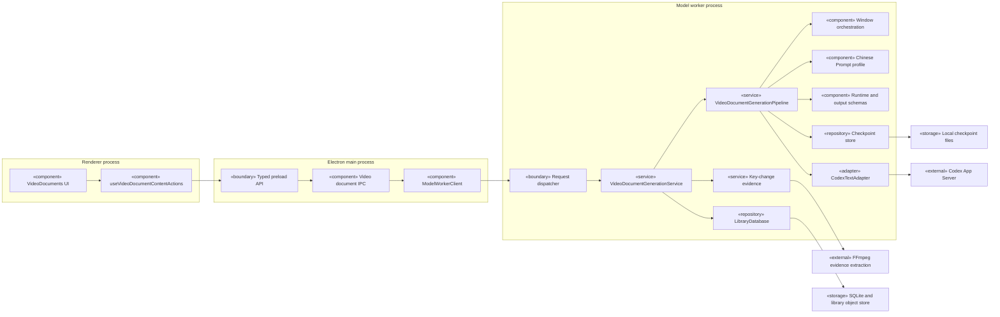
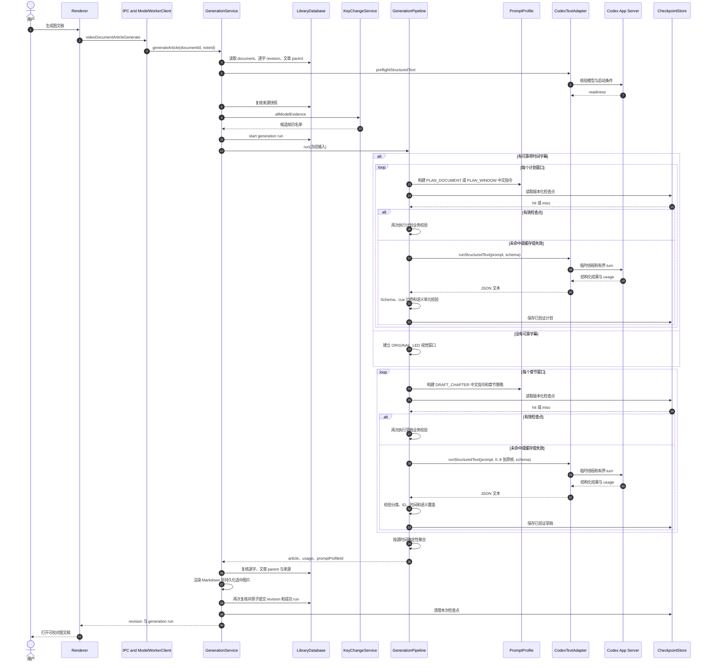
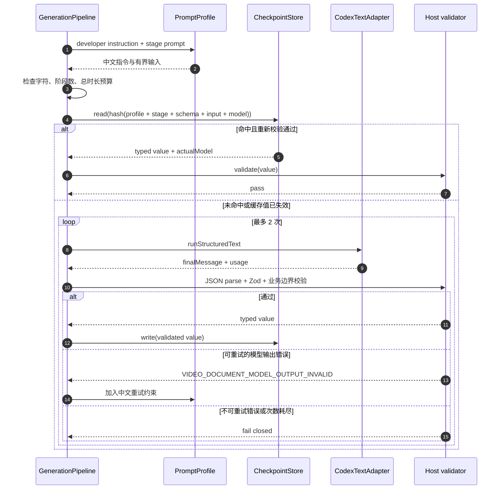
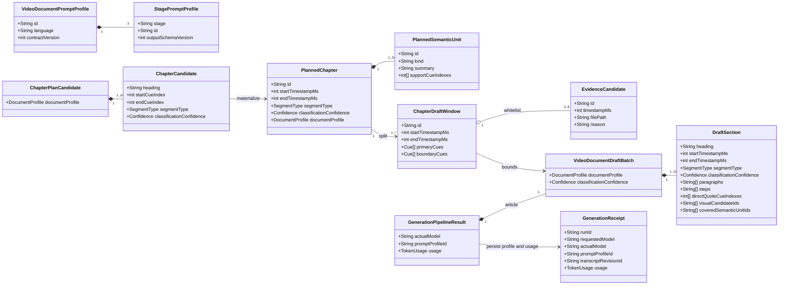
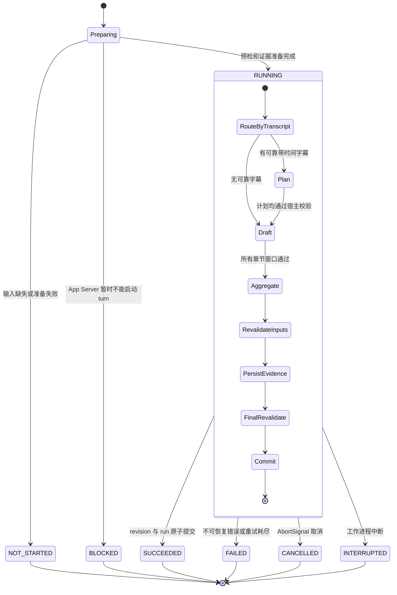
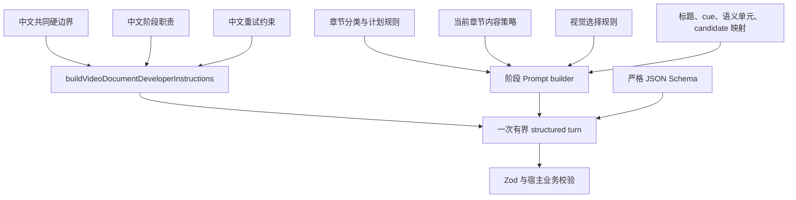
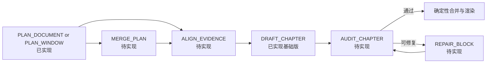

# 视频图文生成运行时与 Prompt Profile 设计

> 状态：`IMPLEMENTED_BASELINE`
> 最近核对：2026-08-14
> 适用范围：`apps/desktop` 当前视频图文生成实现
> 当前 Prompt profile：`video-article-zh-v1`

本文描述代码已经采用的“计划＋有界成文”运行时设计，并给出与实现一一对应的 UML
视图。它不是完整视频理解方案的替代品：章节级证据对齐、独立审计、定点修复和跨计划窗口合并仍是后续扩展点。

## 1. 目标与边界

当前实现解决四件事：

1. 把视频图文的自然语言指令集中到一个中文、版本化的 Prompt profile；
2. 把一次全片生成拆成 `PLAN_DOCUMENT`／`PLAN_WINDOW` 与 `DRAFT_CHAPTER` 两类有界 turn；
3. 让模型只返回严格 JSON，由宿主验证 cue、语义单元、候选图和时间范围；
4. 把 Prompt 版本写入检查点键和成功 revision 的 generation receipt，使结果可追溯且不会跨版本误复用。

当前明确不包含：

- `PLAN_WINDOW` 的重叠输入和 `MERGE_PLAN`；
- 章节级自适应补帧和 `ALIGN_EVIDENCE`；
- 独立的 `AUDIT_CHAPTER` 与 `REPAIR_BLOCK`；
- 模型直接生成 Markdown、磁盘路径或数据库对象；
- 没有可靠字幕时对语音、对白或画面外事实的推断。

## 2. 核心设计决策

| 关注点      | 决策                                                                  | 代码所有者                       |
| ----------- | --------------------------------------------------------------------- | -------------------------------- |
| Prompt 文本 | 所有运行时自然语言指令使用中文；阶段名、字段名和枚举保持 canonical ID | `generation-prompt-profile.ts`   |
| 输出合同    | Zod Schema 与提供给模型的 JSON Schema 独立于自然语言 Prompt           | `generation-profile.ts`          |
| 阶段编排    | 只选择阶段、构建有界输入、执行预算／重试／校验，不内联业务指令        | `generation-pipeline.ts`         |
| 窗口形成    | 按完整 cue 和候选图上限形成计划窗口、章节窗口及视觉回退窗口           | `generation-orchestration.ts`    |
| 模型传输    | 原样传递中文 developer instruction、用户输入、附件和输出 Schema       | `codex-text-adapter.ts`          |
| 持久化      | 服务冻结并复核输入，宿主渲染 Markdown，原子提交 revision 与 run       | `generation-service.ts`          |
| 复用        | 只有完整版本化输入哈希命中且重新通过宿主校验的检查点才可复用          | `generation-checkpoint-store.ts` |

不把完整 Prompt 复制到本文。代码中的 profile 是运行时唯一事实源，本文只冻结职责、依赖和版本规则，避免文档与实际指令出现两套可执行版本。

## 3. UML 组件图

下图同时标出 Electron 主进程与模型工作进程边界。渲染层不能直接读取本地证据路径、SQLite
或 Codex App Server。

### 3.1 组件职责约束

- `PromptProfile` 可以生成中文指令，但不能调用模型、访问数据库或决定重试。
- `Pipeline` 可以选择 stage profile，但不能新增临时 Prompt 字符串绕开 profile。
- `CodexTextAdapter` 只处理可用性、临时线程、附件、Schema、取消和用量，不追加业务角色说明。
- `Service` 是提交边界；模型结果在它完成输入复核、确定性渲染和媒体绑定之前不是正式文稿。
- `Renderer` 只得到类型化结果和 revision，不得到候选帧本地路径或模型线程的文件系统权限。

## 4. UML 时序图

### 4.1 一次成功生成

图中为主路径。若预检不能启动 turn，则记录 `BLOCKED`；输入不可用或准备失败则记录
`NOT_STARTED`。只有准备完成后才创建 `RUNNING` run。

### 4.2 单个模型阶段的检查点与重试

检查点不是信任边界。命中后仍执行同一宿主业务校验；版本或动态输入任何一项变化都会得到不同哈希。

## 5. UML 领域类图

类图只表达当前内存合同之间的关系，不暗示新增数据库表。

关键不变量：

- `ChapterCandidate` 只能引用当前计划窗口提供的 cue；物化后章节连续、无重叠，并恰好覆盖该窗口全部 cue。
- 每个 `PlannedSemanticUnit` 获得宿主生成的稳定 ID，支持 cue 必须位于父章节。
- `DraftSection` 必须复制父章节的类型与置信度；成文阶段不能重新分类。
- 一个章节窗口中的必要语义 ID 必须被草稿恰好覆盖一次。
- 直接引语只返回 cue ID，原文由宿主复制；图片只返回当前白名单 candidate ID。
- `GenerationReceipt.promptProfileId` 对旧 revision 可缺省，对新成功生成必须写入当前 profile ID。

## 6. UML 状态图

`NOT_STARTED` 与 `BLOCKED` 是准备阶段的诚实结果，不伪造为一次已经开始的失败调用。运行中任一来源、逐字 revision 或文章 parent 发生变化时，提交必须失败关闭。

## 7. Prompt 组合与版本管理

### 7.1 组合结构

共同 developer instruction 不包含动态数据；字幕、标题、文件名、图片说明和既有 JSON 全部在硬边界中被声明为惰性来源数据。每次 turn 只注入当前阶段和当前章节所需的策略，不把九种内容策略全部重复发送。

### 7.2 当前 profile

| 范围       | ID                                  | Schema 版本         | 职责                             |
| ---------- | ----------------------------------- | ------------------- | -------------------------------- |
| 总 profile | `video-article-zh-v1`               | `contractVersion=1` | 标识整套中文 Prompt 行为         |
| 完整计划   | `video-article-plan-document-zh-v1` | `1`                 | 在一个有界字幕输入内形成完整计划 |
| 窗口计划   | `video-article-plan-window-zh-v1`   | `1`                 | 只规划当前字幕窗口               |
| 章节成文   | `video-article-draft-chapter-zh-v1` | `2`                 | 在冻结章节和证据白名单内成文     |

### 7.3 变更与失效矩阵

| 变化                                               | 必须更新                                          | 自动失效依据                                |
| -------------------------------------------------- | ------------------------------------------------- | ------------------------------------------- |
| 事实边界、分类、语义覆盖、剧透、选图或失败回退改变 | 总 profile ID、受影响 stage ID                    | profile 与 stage ID 进入检查点键            |
| 阶段职责或 Prompt 组合合同改变                     | 总 profile ID、`contractVersion`、受影响 stage ID | contract version 进入检查点键               |
| 输出字段结构或字段语义改变                         | 上述 ID 与对应 `outputSchemaVersion`              | Schema 版本和 Schema 内容进入检查点键       |
| 标题、字幕、候选帧、语义单元等运行输入改变         | 不升级 profile                                    | 构建后的 Prompt、附件和候选 ID 进入检查点键 |
| 请求模型或推理强度改变                             | 不升级 profile                                    | model 与 effort 进入检查点键                |
| 不改变行为的错字修正                               | 可不升级                                          | 变更后的完整 Prompt 本身仍改变检查点哈希    |

新阶段只有在中文 Prompt、严格运行时 Schema、宿主白名单校验、预算、检查点版本和失败语义同时具备时才可加入 `VIDEO_DOCUMENT_PROMPT_PROFILE.stages`。

## 8. 当前预算与失败关闭

| 限制                     |  当前值 | 所有者                                   |
| ------------------------ | ------: | ---------------------------------------- |
| 计划窗口 cue 数          |     500 | `generation-orchestration.ts`            |
| 计划窗口估算字符数       |  60,000 | `generation-orchestration.ts`            |
| 单阶段最终 Prompt 字符数 | 120,000 | `generation-pipeline.ts`                 |
| 单个模型 turn 图片数     |       8 | `generation-orchestration.ts` 与 adapter |
| 单阶段模型输出尝试       |       2 | `generation-pipeline.ts`                 |
| 一次 pipeline 最大阶段数 |      64 | `generation-pipeline.ts`                 |
| 单阶段时限               | 15 分钟 | `generation-pipeline.ts`                 |
| pipeline 总时限          | 50 分钟 | `generation-pipeline.ts`                 |
| 已知总 token 上限        | 500,000 | `generation-pipeline.ts`                 |
| 最终文章 section 数      |     500 | `generation-pipeline.ts`                 |
| 单个检查点大小           |   4 MiB | `generation-checkpoint-store.ts`         |

模型结果依次经过：响应字节上限、JSON 解析、Zod Schema、阶段业务校验、全文业务校验和提交前输入复核。任何未知 ID、越界时间、重分类、漏掉必要语义或输入并发变化都不会降级成“尽量保存”。

## 9. 后续扩展接缝

下一阶段沿现有边界扩展，不把新职责重新塞回 `DRAFT_CHAPTER`：

- `MERGE_PLAN` 需要重叠计划窗口、稳定冲突规则和独立 Schema；当前顺序拼接不等同于合并。
- `ALIGN_EVIDENCE` 需要章节级证据计划和视觉组合同；当前 0–8 张窗口白名单只是基础候选约束。
- `AUDIT_CHAPTER` 必须使用隔离 turn，只报告结构化 issue；不能继承生成线程的解释历史。
- `REPAIR_BLOCK` 只能替换 issue 指定的最小块，并继续使用同一个不可变 run context。

## 10. 代码追踪

| 设计项                             | 实现位置                                                                                          |
| ---------------------------------- | ------------------------------------------------------------------------------------------------- |
| 中文 Prompt、profile 和阶段构建器  | [`generation-prompt-profile.ts`](../../src/main/video-documents/generation-prompt-profile.ts)     |
| Prompt 管理约定                    | [`PROMPTS.md`](../../src/main/video-documents/PROMPTS.md)                                         |
| 输出 Schema 与领域类型             | [`generation-profile.ts`](../../src/main/video-documents/generation-profile.ts)                   |
| 计划／章节窗口与确定性物化         | [`generation-orchestration.ts`](../../src/main/video-documents/generation-orchestration.ts)       |
| 阶段执行、检查点、预算、重试和校验 | [`generation-pipeline.ts`](../../src/main/video-documents/generation-pipeline.ts)                 |
| 输入快照、渲染、媒体绑定和原子提交 | [`generation-service.ts`](../../src/main/video-documents/generation-service.ts)                   |
| 检查点文件合同                     | [`generation-checkpoint-store.ts`](../../src/main/video-documents/generation-checkpoint-store.ts) |
| Codex App Server 结构化文本适配    | [`codex-text-adapter.ts`](../../src/main/assistant/codex-text-adapter.ts)                         |
| generation receipt 与 IPC 数据合同 | [`video-document.ts`](../../src/shared/contracts/video-document.ts)                               |
