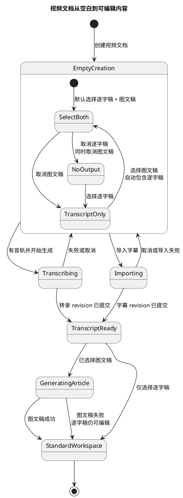
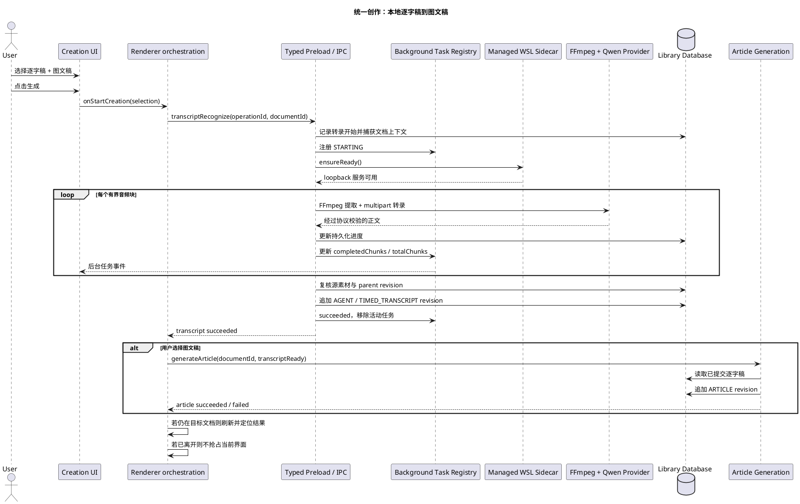
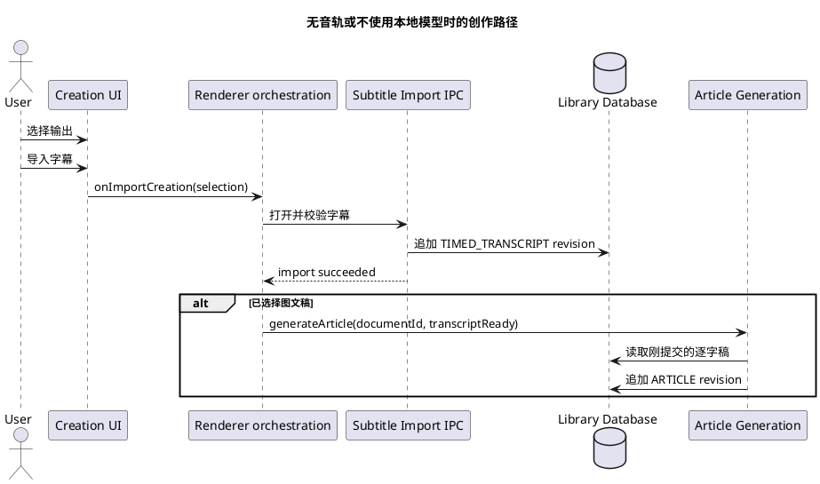
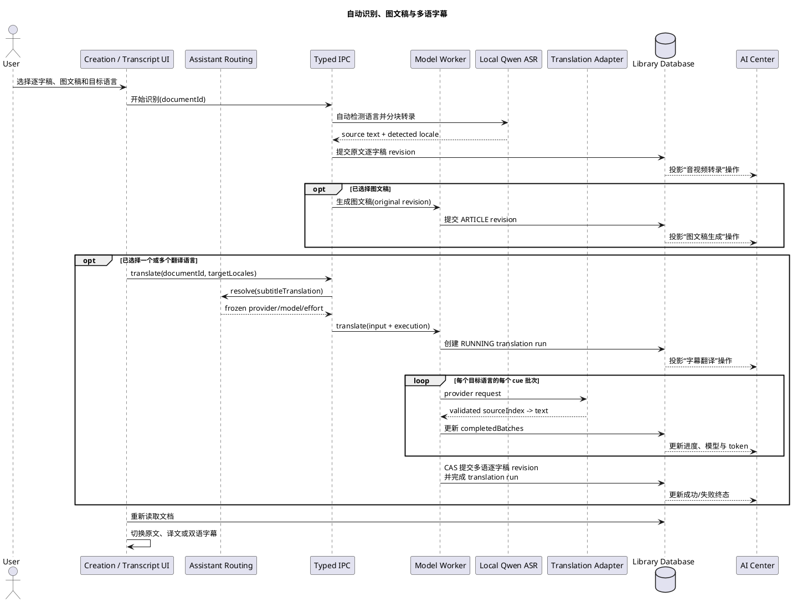
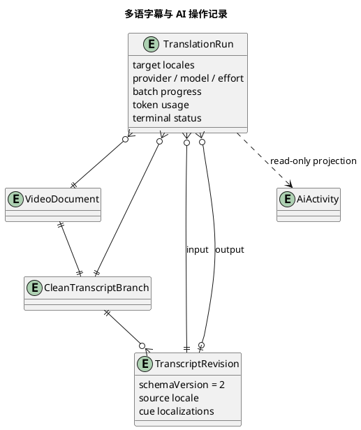

# 视频文档统一创作与后台转录工作流

状态：已实现的产品与架构决策
记录日期：2026-08-13
目标版本：0.3.2

## 1. 问题与决策

视频文档刚创建时，逐字稿和图文稿都没有 revision。若此时直接展示“逐字稿”“图文稿”两个空页签，用户需要先理解内部产物依赖，才能决定该点击哪个页签、先执行什么操作。这把系统流程暴露给了用户，也让“新建完成但没有草稿”看起来像数据缺失。

本方案改为结果导向的统一入口：

- 当 `CLEAN_TRANSCRIPT` 与 `ARTICLE` 都没有 `latestDraftRevisionId` 时，显示合成的“创作”页签；
- 用户在同一处选择要得到“逐字稿”还是“逐字稿 + 图文稿”；
- 图文稿依赖逐字稿，系统自动串联，不要求用户等待后再进入另一个页签；
- `NOTES` 是独立的人工作业面，存在时继续显示“笔记”页签，不参与空白态判断；
- 一旦逐字稿或图文稿产生 revision，退出统一创作态，恢复标准内容页签。

“创作”是空白阶段的工作入口，不是新的持久化 branch，也不改变现有文档数据模型。

## 2. 用户体验原则

1. **先选择结果，不选择技术流程。** 用户只回答“我要什么”，系统处理转录、依赖和模型启动。
2. **默认完成最常见任务。** 初始默认勾选逐字稿和图文稿，一次操作得到完整结果。
3. **依赖关系由界面保证。** 选择图文稿会自动选择逐字稿；取消逐字稿会同时取消图文稿。
4. **长任务不占住工作区。** 转录进入全局后台任务状态，用户可打开其他文档；返回后根据任务快照重新附着。
5. **不抢夺用户当前上下文。** 用户已经离开目标文档时，成功刷新导航与持久化状态，但不强制切回该文档或页签。
6. **失败不产生半成品。** 转录失败或取消不保存局部逐字稿，也不会继续生成图文稿。
7. **本地能力不要求本地 API Key。** Desktop 自动托管 WSL Sidecar，端口与会话令牌属于内部实现。

## 3. 进入与退出条件

统一创作态只依据可交付内容是否存在：

```text
creationEmpty =
  CLEAN_TRANSCRIPT.latestDraftRevisionId == null
  AND ARTICLE.latestDraftRevisionId == null
```

| 当前内容           | 显示方式                                       |
| ------------------ | ---------------------------------------------- |
| 无逐字稿、无图文稿 | “创作”；若存在 Notes branch，同时显示“笔记”    |
| 有逐字稿、无图文稿 | 恢复标准逐字稿、图文稿、笔记等页签             |
| 无逐字稿、有图文稿 | 恢复标准页签；数据层仍应保证图文稿具有有效来源 |
| 有逐字稿、有图文稿 | 恢复标准页签                                   |

标题、所属图集与右侧源视频播放器在统一创作态中继续保留，避免把“选择输出”做成脱离文档上下文的模态向导。

## 4. 输出选择与动作规则

### 4.1 有可用音轨

| 逐字稿 | 图文稿 | 主动作             | 结果                         |
| ------ | ------ | ------------------ | ---------------------------- |
| 选中   | 选中   | 生成逐字稿和图文稿 | 后台转录成功后自动生成图文稿 |
| 选中   | 未选   | 生成逐字稿         | 只执行后台转录               |
| 未选   | 未选   | 禁用               | 尚未形成有效创作意图         |
| 未选   | 选中   | 不允许稳定存在     | 选择图文稿时自动补选逐字稿   |

“导入字幕”始终作为本地识别之外的显式替代入口。若图文稿已选中，动作显示为“导入字幕并生成图文稿”。

### 4.2 没有可用音轨

- 禁用模型识别主动作；
- 明确展示音轨不可用状态；
- 保留字幕导入；
- 字幕导入成功后，若用户选择了图文稿，则继续生成图文稿；
- 不自动改用远程 Provider，也不伪造空逐字稿。

### 4.3 运行中

- 选择卡和导入操作锁定，防止同一文档重复提交；
- 主动作替换为当前阶段或分块进度，点击可打开任务详情；
- 详情提供取消、耗时、速度、GPU 指标和等效 API 成本；
- 关闭详情不会取消任务。

## 5. 用户状态 UML



## 6. 端到端时序 UML

### 6.1 本地识别后自动生成图文稿



### 6.2 字幕导入替代路径



## 7. 组件与责任边界

| 层次                                    | 责任                                                        | 不应承担的责任                         |
| --------------------------------------- | ----------------------------------------------------------- | -------------------------------------- |
| `VideoDocumentEmptyCreation`            | 输出选择、依赖约束、动作与运行中反馈                        | Provider、路径、命令、数据库写入       |
| `VideoDocumentEmptyWorkspace`           | 合成“创作”页签、保留 Notes 与源视频上下文                   | 创建新的持久化 branch                  |
| `VideoDocumentsScreen`                  | 串联“先逐字稿、后图文稿”，捕获目标文档 ID                   | 绕过 Main 的转录或生成校验             |
| `useVideoDocumentTranscriptRecognition` | 附着后台任务、进度、取消、终态刷新                          | 保存局部逐字稿或解析模型响应           |
| typed Preload / IPC                     | 对输入、结果和事件做 schema 校验                            | 接受 Renderer 提供的文件系统路径或命令 |
| Background Task Registry                | 活动任务快照、进度、取消、终态广播                          | 充当最终业务数据源                     |
| Sidecar Manager                         | 自动启动受控 WSL 服务、loopback 会话与 GPU telemetry        | 暴露本地 API Key 配置给用户            |
| Recognition Service                     | 源快照、FFmpeg 分块、Provider 调用、业务输出校验和 CAS 提交 | 修改 Renderer 状态                     |
| Library Database                        | 转录运行记录、不可变 revision、事务与冲突保护               | 保存 WAV、会话令牌或完整原始响应       |

## 8. 数据与一致性约束

模型或导入产生的逐字稿继续使用现有内容模型：

- `format = TIMED_TRANSCRIPT`；
- 本地模型使用 `transcriptBasis = AUDIO_TRANSCRIPT`；
- 本地模型使用 `textTreatment = VERBATIM`；
- revision `origin = AGENT`；
- `sourceHash` 对规范化逐字稿正文计算，不冒充视频对象 hash；
- 视频对象 hash、source asset 和 parent revision 属于运行快照与冲突校验；
- cue 必须有序、有界且不超过源视频时长；
- 只有完整输出通过 Provider envelope、模型正文和业务 schema 三层校验后才提交。

开始转录时捕获：

```text
documentId
branchId
sourceAssetId
sourceObjectHash
sourceByteSize
durationMs
expectedParentRevisionId
```

提交前重新读取当前文档。源视频、对象 hash、branch 或 parent revision 任一变化都停止提交，不能覆盖用户在任务期间导入或编辑的逐字稿。图文稿生成只读取已经提交的逐字稿 revision，不读取内存中的模型片段。

## 9. 后台任务语义

当前“后台”具有以下产品保证：

- Renderer 不被长时间计算阻塞；
- 活动任务进入全局任务中心；
- 切换文档后任务继续，返回时可通过 snapshot 和 revisioned event 重新附着；
- 用户可以取消；
- 成功、失败和取消具有结构化终态；
- 关闭资料库上下文前会取消或 drain 任务。

当前本地 GPU 资源池全局并发为 1。其他文档已有本地转录时，新请求返回 `LOCAL_MODEL_BUSY`，不会在显存不足时隐式并行。

需要区分：本地转录已经具备后台任务与持久化运行记录，但“转录成功后继续生成图文稿”的组合编排当前由 Renderer promise 链维持。若应用在两个阶段之间退出，已提交的逐字稿保留，图文稿不会自动恢复；用户可从标准工作区继续生成。

后续只有在要求跨重启自动续跑时，才将组合任务升级为 Main 持久化工作流：

```text
CREATE_CONTENT_BUNDLE
  -> TRANSCRIPT_LOCAL | TRANSCRIPT_IMPORT
  -> ARTICLE_GENERATE (optional)
```

## 10. 错误与恢复

| 场景                         | 用户结果           | 后续动作                         |
| ---------------------------- | ------------------ | -------------------------------- |
| 无音轨                       | 模型识别禁用       | 导入字幕或替换源视频             |
| WSL/模型未安装               | 显示本地服务不可用 | 安装后重试，不要求 API Key       |
| 本地模型忙                   | 不启动第二个任务   | 等待或取消已有任务               |
| FFmpeg/Sidecar/Provider 失败 | 不提交逐字稿       | 显示结构化错误并允许重试         |
| 返回为空或协议无效           | fail closed        | 不把控制标记或畸形文本保存为正文 |
| 源视频在运行中变化           | 不提交             | 使用新源重新开始                 |
| 逐字稿 parent 发生变化       | 不覆盖人工结果     | 刷新后由用户决定是否重新识别     |
| 用户取消                     | 停止分块与请求     | 保留任务前已有 revision          |
| 图文稿生成失败               | 保留成功逐字稿     | 在标准图文稿页重试               |

## 11. 指标与成本展示

任务详情展示的是运行观测，而不是模型计费：

- 音频时长；
- 已耗时间；
- 处理速度或实时倍速；
- GPU 使用率；
- GPU 显存；
- GPU 功率；
- 根据功率采样积分得到的 GPU 能耗；
- 同时长云端 API 的等效输入价格。

等效 API 价格只用于比较“若使用对应云端识别 API 的输入费用”，不代表本地任务实际产生了 API 账单。电费必须使用明确口径：

```text
GPU 电量 kWh = GPU 能耗 Wh / 1000
GPU 等效电费 = GPU 电量 kWh × 当地电价
```

该值不包含 CPU、内存、风扇、电源损耗和显示器。需要表达整机电费时，应使用插座功率计或可信的整机功率采样，不能把 GPU 功率直接称为整机功率。硬件分档与模型比较见 [本地 ASR 模型与硬件分档方案](local-asr-model-and-hardware-strategy.md)。

## 12. Provider 扩展

当前 `providerKey` 固定为 `qwen-local`，模型由 Main resolver 选择。未来接入远程或其他本地模型时保持以下边界：

- “创作”界面仍选择输出，不直接暴露模型部署参数；
- 若需要模型选择，应放在独立的能力/质量设置中；
- 本地模型不显示 API Key；远程 Provider 的 credential 由统一设置与安全存储管理；
- 新 Provider 追加 adapter 和 route，不改变 `TIMED_TRANSCRIPT`、revision 与文章依赖契约；
- 不同 Provider 的时间戳、说话人和置信度能力必须显式声明，不能因为接口兼容就视为语义兼容。

## 13. 当前限制与演进顺序

1. 当前 Qwen cue 仍以主机音频分块为时间边界，不是字词级精确对齐；下一阶段接入 Forced Aligner。
2. 活动任务进度是完成块数，不是 token 进度；只有可测量阶段才显示百分比。
3. 本地转录全局单并发；多 GPU 或批量队列必须先建立资源池与显存准入。
4. 组合编排尚不能跨应用重启自动续跑；先保留已成功的逐字稿，再由用户继续图文稿。
5. 新模型必须经过同一私有素材集的质量、速度、显存和稳定性准入，不能仅凭公开 benchmark 成为默认项。

## 14. 验收契约与测试边界

产品验收至少保证：

- 两类内容都为空时只出现统一“创作”入口，Notes 仍独立可用；
- 默认双选、依赖联动、仅逐字稿和无音轨导入路径行为一致；
- 转录成功后才允许自动启动图文稿；失败、取消或缺少目标文档时不误启动；
- 切换文档不取消后台转录，也不在完成时抢占当前文档；
- 完整视频输入可以经过 FFmpeg、受管 WSL/Qwen、逐字稿提交和重开读取；
- 公开仓库不保存详细测试、夹具、trace 或失败证据。

详细 unit、component、integration 与硬件 E2E 不属于本文的公开产品契约。本文只记录公开的产品行为和验收边界，不复制具体测试场景内容。

## 15. 多语字幕翻译

### 15.1 用户入口与术语

- 音轨识别始终自动判断源语言，不要求用户在开始识别前选择语言；识别结果把规范语言标签写入 cue。
- 面向读者的展示名称使用“字幕”和“笔记”；进入编辑语境后使用“逐字稿”和“图文稿”。
- 空白“创作”界面可以同时选择逐字稿、图文稿和字幕翻译语言；一次任务最多选择 5 种，单份逐字稿最多保留 10 种译文。选择翻译语言会自动包含逐字稿。
- 已有逐字稿时，语言栏负责原文/译文切换、原文与译文双语显示，以及“添加翻译”。hover 只提供快捷动作，不能作为唯一入口。
- 翻译只增加目标语言版本，不改写识别原文，也不覆盖已有的人工译文。需要重译已有语言时，应另设明确的重译确认流程。

### 15.2 模型配置边界

创作界面只维护“翻译成哪些语言”，不保存逐任务 Provider 或 credential。翻译确认框只读展示当前将使用的 Provider、模型和推理强度，真正的选择仍由 AI 中心的统一模型路由管理。字幕翻译作为统一助手能力 `subtitleTranslation` 进入 AI 中心的模型路由：

```text
Creation / Transcript UI
  -> targetLocales
  -> assistantRouting.resolve("subtitleTranslation")
  -> frozen provider + model + reasoning effort
  -> model worker
```

任务开始时冻结解析后的模型配置并写入运行记录，避免运行期间用户修改 AI 中心设置导致同一任务前后使用不同模型。首期执行适配器为 Codex 结构化文本生成；本地 Qwen 只负责 ASR。`subtitleTranslation` 首期默认使用 GPT-5.6 Luna 与 `max` 推理强度，用户在 AI 中心保存的显式设置优先。后续接入其他翻译 Provider 时新增 route/adapter，不改变创作界面和逐字稿内容契约。

### 15.3 后台执行与 AI 中心记录

字幕翻译具有独立的持久化运行记录 `video_document_translation_runs`，不会混入本地转录记录。每次运行保存：

- 文档、branch、输入与输出 revision；
- 目标语言集合；
- Provider、请求模型、实际模型和推理强度；
- 批次进度、token 使用量、开始/结束时间；
- 结构化成功、失败、中断状态与错误信息。

AI 中心把它投影为独立的“字幕翻译”操作，可按类别筛选，并显示目标语言、模型、耗时、批次进度、token 与可计算时的 API 等效价格。切换文档或关闭翻译对话框不终止任务；Renderer 通过持久化活动重新附着状态。

逐字稿语言栏同时显示前台实时状态：模型仍在处理当前批次时只显示真实已耗时，不伪造百分比；每个批次完成后显示 `completedBatches/totalBatches`。已耗时每秒更新，持久化批次由文档页和 AI 中心轮询同步。运行中可从语言栏取消，取消信号经 IPC 传入 model worker 与 Codex App Server。

翻译批次最多 40 个 cue 或 8,000 个源字符。单次 Codex turn 使用按推理强度分级的**空闲超时**：常规 5 分钟，`high/xhigh` 10 分钟，`max` 15 分钟，`ultra` 20 分钟；收到 reasoning、输出、token usage 或状态事件时续期，持续活动的模型不会因启动时间过久被中断。完整后台翻译另有独立的 6 小时绝对上限，不复用图文稿的 1 小时预算。空闲超时必须记录为可重试的结构化翻译错误。

### 15.4 内容与一致性

多语逐字稿使用 `TIMED_TRANSCRIPT` schema v2：每个 cue 保留一份源文本及其 `textLocale`，翻译写入该 cue 的 `localizations[]`。同一目标语言必须覆盖完全相同的 `sourceIndex` 集合，缺失、重复、额外 cue 或非法 locale 均 fail closed。

翻译开始时捕获当前逐字稿 revision，完成时再次确认 parent 未变化，并在同一事务内追加 `AGENT` revision、完成运行记录。任务期间若用户编辑、导入、重新识别或其他任务改变逐字稿，则不覆盖新内容。图文稿生成与字幕翻译互斥提交；统一创作流程当前按“逐字稿 → 图文稿（可选）→ 字幕翻译（可选）”执行，以保证图文稿稳定读取原始逐字稿 revision。

### 15.5 端到端时序 UML



### 15.6 数据关系 UML



## 16. 主要实现依据

- `src/renderer/features/video-documents/VideoDocumentEmptyCreation.tsx`
- `src/renderer/features/video-documents/VideoDocumentEmptyWorkspace.tsx`
- `src/renderer/features/video-documents/VideoDocumentWorkspacePane.tsx`
- `src/renderer/features/video-documents/VideoDocumentsScreen.tsx`
- `src/renderer/features/video-documents/VideoDocumentTranscriptLanguageBar.tsx`
- `src/renderer/features/video-documents/VideoDocumentTranscriptTranslationDialog.tsx`
- `src/renderer/features/video-documents/useVideoDocumentTranscriptTranslation.ts`
- `src/renderer/features/video-documents/useVideoDocumentTranscriptRecognition.ts`
- `src/renderer/features/video-documents/useVideoDocumentContentActions.ts`
- `src/main/ipc/video-document-transcription-handlers.ts`
- `src/main/ipc/video-document-handlers.ts`
- `src/main/video-transcript/background-task-registry.ts`
- `src/main/video-transcript/recognition-service.ts`
- `src/main/video-transcript/translation-service.ts`
- `src/main/extensions/local-qwen-asr/sidecar-manager.ts`
- `src/main/assistant/assistant-routing.ts`
- `src/main/database/video-documents/video-document-translation-repository.ts`
- `src/main/database/video-documents/video-document-translation-run-repository.ts`
- `src/shared/contracts/video-document.ts`
- `src/shared/contracts/video-document-transcript-content.ts`
- `src/shared/contracts/video-document-transcription.ts`
- `src/shared/contracts/video-document-translation.ts`

相关文档：

- [本地 ASR 模型与硬件分档方案](local-asr-model-and-hardware-strategy.md)
- [本地 Qwen ASR 无效逐字稿故障分析](local-qwen-asr-failure-analysis.md)
- [Windows WSL2 部署 Qwen3-ASR](../tutorials/07-qwen3-asr-wsl-local-deployment.md)
