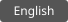

# Releases

[](release.md) [](release.en.md)

This page covers source versions, Git tags and Windows Store submission. See [Packaging](packaging.en.md) for artifacts and [Development](development.en.md) for environment setup. Run commands from the desktop application repository root.

## Release sequence

1. Choose the version and scope, and prepare user-facing release notes in Chinese and English.
2. Review the selected files and complete diff against the previous public version, then form the final commit.
3. Run applicable checks, package and validate that commit, and verify versions, source identity and artifact hashes.
4. Publish the reviewed source commit and version tag, and submit the appropriate artifacts to each distribution channel.
5. Confirm source availability, Store submission, certification and availability separately.

When source, dependencies, manifests or build inputs change, reassess the affected checks and rebuild the package. Results for the previous package no longer establish readiness. Retrying the same candidate does not require another version increment.

## Version checklist

| Item                               | Location and rule                                                                                                                                                                                     |
| ---------------------------------- | ----------------------------------------------------------------------------------------------------------------------------------------------------------------------------------------------------- |
| Application                        | Keep [package.json](../package.json) and the top-level and root-package versions in [package-lock.json](../package-lock.json) aligned                                                                 |
| Store                              | [Package.appxmanifest](../build/msix/Package.appxmanifest) uses `(major + 1).minor.patch.0`, matching the packaging script                                                                            |
| Language extensions                | Align the [built-in English manifest](../src/main/extensions/builtin-manifests.ts) and [Simplified Chinese manifest](../extensions/com.aiy.language.zh-cn/manifest.json) with the application version |
| Other extensions and content packs | Update individual manifests for actual changes; do not increment unchanged components mechanically                                                                                                    |
| Extension Host API                 | Change `EXTENSION_HOST_VERSION` in [product.ts](../src/shared/product.ts) only when the compatibility contract changes                                                                                |
| Database                           | The revision in [schema.ts](../src/main/database/core/schema.ts) and the [SQL files](../src/main/database/sql/); preserve released migrations and keep new migrations compatible with existing data   |
| Browser companion                  | Independently check versions in [package.json](../browser-companion/package.json), its [lockfile](../browser-companion/package-lock.json) and [wxt.config.ts](../browser-companion/wxt.config.ts)     |

Advance each manifest, plugin and database revision at most once per release. Change a cache version only when its storage format or read semantics change. An application patch release does not require changes to the Host API, every plugin or the database.

## Source snapshot

A public release commit contains only files reviewed against an explicit allowlist, with the latest pre-release `origin/main` as its sole parent. Do not import other development history into the public line through merge, squash merge or cherry-pick.

Review source, lockfiles, assets, licenses and documentation in the final diff. Exclude logs, databases, credentials, certificate private keys, temporary outputs and machine-specific configuration that are outside the deliverables. Archived directories are not automatically part of the release allowlist.

Follow [LICENSE](../LICENSE) and [LICENSE-PLUGIN-EXCEPTION](../LICENSE-PLUGIN-EXCEPTION): include both files and third-party notices, provide the corresponding source and necessary build scripts for the actual artifact, and explain how to obtain that source next to the download. Independent plugins may use their own licenses; modifications to the host remain subject to AGPL obligations.

Before any commit or push, verify the actual repository, branch, upstream and remote addresses:

```sh
git status --short --branch
git branch -vv
git remote -v
git remote get-url --push origin
```

`origin` should target the public repository `https://github.com/gantrol/aiy-desktop.git` or its SSH equivalent. After confirming the target, refresh the public base and inspect the candidate, replacing `<release-commit>` with its reviewed full commit ID:

```sh
git fetch --no-tags origin main
git rev-parse origin/main
git rev-list --parents -n 1 <release-commit>
git rev-list --count origin/main..<release-commit>
git diff --stat origin/main <release-commit>
git diff --check origin/main <release-commit>
git diff origin/main <release-commit>
```

The candidate must have exactly one parent, matching the freshly fetched `origin/main`, and the commit count must be `1`. If the public base advances, prepare and review the snapshot again instead of overwriting it with a force push. Preserve published hotfixes and external contributions in subsequent releases.

## Tags and source delivery

Use `v<app-version>` for the version tag. It must point to the final commit recorded as the artifact's `sourceCommit`. If the tag already exists, verify its target; do not move a published release tag.

Once release conditions are satisfied, create an annotated tag and explicitly push both references. Replace the following placeholders with reviewed values:

```sh
git tag -a v<app-version> <release-commit> -m "AIY <app-version>"
git push --atomic --no-follow-tags origin <release-commit>:refs/heads/main refs/tags/v<app-version>:refs/tags/v<app-version>
git ls-remote origin refs/heads/main refs/tags/v<app-version> "refs/tags/v<app-version>^{}"
```

After pushing, confirm that remote `main` and the peeled annotated tag both identify the release commit. Do not use bare `git push`, `--all`, `--mirror` or include unrelated tags. By default, do not upload candidate branches or create public draft pull requests.

GitHub Release notes describe visible changes, compatibility, installation requirements and known issues. Select individual files for distribution instead of uploading an entire build directory.

## Windows Store submission

1. Verify the MSIX and metadata in `submission/` using [Packaging](packaging.en.md#outputs-and-verification). Confirm `sourceDirty: false` and `signedForLocalTest: false`.
2. In Partner Center, select the product matching the manifest identity and Publisher, and upload the unsigned MSIX. Do not upload a `local-test/` package or `.pfx`.
3. Check the parsed version, architecture and device requirements. Update Store descriptions, screenshots, privacy links and support information where needed for this release.
4. Submit and record the submission ID. Wait for certification, then confirm actual availability separately. Upload, certification and publication are distinct Microsoft Store stages. [Publishing workflow](https://learn.microsoft.com/en-us/windows/apps/package-and-deploy/publish-first-app)

Build, validate and deliver the browser companion separately; a desktop MSIX release does not release the companion. Assess macOS artifacts against their own signing, notarization and platform acceptance results.

## Release record

| State              | Record                                                                         |
| ------------------ | ------------------------------------------------------------------------------ |
| Source published   | Application version, final commit, tag and accessible release link             |
| Packaged           | Artifact filename, platform, architecture, SHA-256 and build metadata          |
| Validated          | Checks and platform scenarios actually performed, results and unverified items |
| Submitted to Store | Product, submission ID and submission time                                     |
| Available          | Certification result, Store version and availability                           |

Retain the final MSIX and hash for version verification. Resolve production issues through a subsequent fix release rather than overwriting a published tag or reusing a version to replace a package with different contents.

[Documentation](index.en.md) · [Development](development.en.md) · [Packaging](packaging.en.md)
