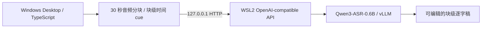

# 07：在 Windows WSL2 部署 Qwen3-ASR

本文说明如何在 Windows 11 的 WSL2 中准备 Qwen3-ASR 本地运行环境，并通过 OpenAI-compatible HTTP API 从 Windows 应用访问它。

本文只部署独立运行时，不把 Python、CUDA、模型权重或缓存写入 Desktop Git 仓库，也不把模型打进 Electron 安装包。

## 当前能力边界

Qwen3-ASR 的本地部署包含两项不同能力：

| 能力       | 组件                       | 结果                       |
| ---------- | -------------------------- | -------------------------- |
| 语音转文字 | `Qwen3-ASR-0.6B` + vLLM    | 文本和语言识别             |
| 字幕时间轴 | `Qwen3-ForcedAligner-0.6B` | 受支持语言的词／字级时间戳 |

官方 `qwen-asr-serve` 可以提供 `/v1/audio/transcriptions` OpenAI-compatible 接口，但其公开示例只返回转写文本。Desktop 第一阶段会把音轨切成有界短块，用每个音频块的源时间范围生成可编辑的粗粒度时间轴；这不是模型原生的词／字级时间戳。精确字幕仍需要 Forced Aligner，并由单独的本地 Sidecar 将时间戳转换成应用可校验的字幕结果。

因此：

- 裸 `qwen-asr-serve` 已可用于 Desktop 的第一阶段逐字稿识别；生成的是音频块级时间 cue；
- `qwen-asr-demo` 可以验证 Forced Aligner，但它是 Gradio 演示服务，不是 Desktop 的稳定协议；
- 后续精确时间戳接入应使用项目定义的 OpenAI-compatible Sidecar；不要把 Gradio 地址填入模型连接。



## 硬件与系统要求

第一阶段建议配置：

| 项目     | 最低保护线                      | 推荐配置                                         |
| -------- | ------------------------------- | ------------------------------------------------ |
| Windows  | Windows 11 x64 + WSL2           | 保持 Windows、WSL 内核和 NVIDIA 驱动为当前稳定版 |
| GPU      | NVIDIA CUDA，计算能力不低于 7.5 | 12 GB 或更多显存                                 |
| 系统内存 | 16 GB                           | 32 GB 或更多                                     |
| 磁盘     | 至少 20 GB 可用空间             | 模型、Python 环境和缓存放在 WSL Linux 文件系统   |
| Python   | 3.10–3.13                       | 独立 Python 3.12 环境                            |

显存建议：

- 少于 8 GB：不要启用本地带时间戳字幕；
- 8–11 GB：只尝试 `0.6B + Aligner`、Transformers、batch 1；
- 12–15 GB：推荐 `0.6B + Aligner`，ASR 可使用 vLLM；
- 16 GB 或更多：可以再评估 `1.7B + Aligner`。

模型文件的 BF16 体积不等于实际显存占用。vLLM 还需要激活、KV cache、CUDA graph 和临时张量；运行前应关闭其他占用大量显存的程序。

vLLM 不原生支持 Windows，Windows 用户应通过 WSL2 运行。不要安装社区 Windows fork 作为默认运行时。

## 1. 安装并检查 WSL2

在管理员 PowerShell 中安装或更新 WSL：

```powershell
wsl --install -d Ubuntu
wsl --update
wsl --set-default-version 2
```

安装完成后按系统提示重启，并在 Ubuntu 首次启动时创建 Linux 用户。

确认发行版使用 WSL2：

```powershell
wsl --status
wsl --list --verbose
```

预期 Ubuntu 的 `VERSION` 为 `2`。

Windows 只需安装正常的 NVIDIA Windows 驱动。不要在 WSL 中安装 Linux NVIDIA 显示驱动；WSL 使用 Windows 驱动提供的 CUDA 能力。

进入 WSL 并检查 GPU：

```powershell
wsl -d Ubuntu
```

```bash
nvidia-smi
```

如果 WSL 找不到 `nvidia-smi` 或看不到 NVIDIA GPU，先修复 Windows 驱动和 WSL，而不是继续安装 vLLM。

安装 vLLM/Triton 首次编译 CUDA 辅助模块所需的 C/C++ 工具链：

```bash
sudo apt-get update
sudo apt-get install -y --no-install-recommends build-essential
gcc --version
g++ --version
```

如果缺少编译器，模型权重可以加载，但服务会在 `torch.compile` 阶段以 `Failed to find C compiler` 退出。

## 2. 创建独立运行目录

以下命令都在 WSL Ubuntu 中执行：

```bash
export CATAI_QWEN_ROOT="$HOME/.local/share/catai-qwen-asr"
mkdir -p "$CATAI_QWEN_ROOT/bin"
mkdir -p "$CATAI_QWEN_ROOT/models"
mkdir -p "$CATAI_QWEN_ROOT/cache"
```

不要把运行目录建在：

- `apps/desktop/` 或其他 Git 仓库中；
- Desktop 用户本地空间的数据库或 `objects/` 目录中；
- Windows 挂载目录 `/mnt/c`、`/mnt/d` 中。Linux Python 环境放在 WSL 文件系统通常更快、更稳定。

## 3. 安装 uv 和 Python 3.12

安装独立的 uv，不修改全局 Python：

```bash
curl -LsSf https://astral.sh/uv/install.sh \
  -o "$CATAI_QWEN_ROOT/uv-installer.sh"

UV_INSTALL_DIR="$CATAI_QWEN_ROOT/bin" \
UV_NO_MODIFY_PATH=1 \
sh "$CATAI_QWEN_ROOT/uv-installer.sh"
```

创建 Python 3.12 虚拟环境：

```bash
"$CATAI_QWEN_ROOT/bin/uv" venv \
  "$CATAI_QWEN_ROOT/venv" \
  --python 3.12 \
  --managed-python

source "$CATAI_QWEN_ROOT/venv/bin/activate"
python --version
```

预期输出为 Python 3.12.x。不要使用当前系统可能自带的 Python 3.14。

## 4. 安装 Qwen3-ASR 和 vLLM

安装官方 Python 包及 vLLM 后端：

```bash
"$CATAI_QWEN_ROOT/bin/uv" pip install \
  --python "$CATAI_QWEN_ROOT/venv/bin/python" \
  --upgrade \
  "qwen-asr[vllm]"
```

首次安装需要下载数 GB 的 PyTorch、CUDA 和 vLLM 依赖。不要中断正在解包的安装进程。

截至 2026-08-12，本项目已验证以下组合：

```text
Python     3.12.13
qwen-asr  0.0.6
vLLM      0.14.0
PyTorch   2.9.1 + CUDA 12.8
```

教程不强制永久锁定这些版本。升级后应重新检查 CUDA、API 返回结构和时间戳结果，再用于正式字幕。

## 5. 验证 Python、CUDA 和服务入口

运行只加载 Python 包、不加载模型权重的检查：

```bash
python - <<'PY'
import torch
import vllm
import qwen_asr

print("torch:", torch.__version__)
print("vllm:", vllm.__version__)
print("cuda available:", torch.cuda.is_available())
print("cuda runtime:", torch.version.cuda)
print("device:", torch.cuda.get_device_name(0) if torch.cuda.is_available() else None)
print("capability:", torch.cuda.get_device_capability(0) if torch.cuda.is_available() else None)
PY
```

预期满足：

- `cuda available: True`；
- GPU 名称正确；
- NVIDIA 计算能力不低于 `(7, 5)`。

检查服务命令：

```bash
qwen-asr-serve --help
```

如果包导入失败，不要继续下载模型；先重新创建干净的 Python 3.12 环境。

## 6. 下载模型权重

模型权重属于用户本地运行数据，不提交到 Git，也不进入应用安装包。

中国大陆网络优先使用 ModelScope：

```bash
"$CATAI_QWEN_ROOT/bin/uv" pip install \
  --python "$CATAI_QWEN_ROOT/venv/bin/python" \
  --upgrade modelscope

modelscope download \
  --model Qwen/Qwen3-ASR-0.6B \
  --local_dir "$CATAI_QWEN_ROOT/models/Qwen3-ASR-0.6B"
```

第一阶段到这里已经足够。只有准备精确时间戳 Sidecar 时，才需要额外下载 Forced Aligner：

```bash
modelscope download \
  --model Qwen/Qwen3-ForcedAligner-0.6B \
  --local_dir "$CATAI_QWEN_ROOT/models/Qwen3-ForcedAligner-0.6B"
```

也可以使用 Hugging Face：

```bash
"$CATAI_QWEN_ROOT/bin/uv" pip install \
  --python "$CATAI_QWEN_ROOT/venv/bin/python" \
  --upgrade "huggingface_hub[cli]"

hf download Qwen/Qwen3-ASR-0.6B \
  --local-dir "$CATAI_QWEN_ROOT/models/Qwen3-ASR-0.6B"
```

精确时间戳 Sidecar 再执行：

```bash
hf download Qwen/Qwen3-ForcedAligner-0.6B \
  --local-dir "$CATAI_QWEN_ROOT/models/Qwen3-ForcedAligner-0.6B"
```

应用启动和转写过程不应隐式下载模型。正式使用时只引用已经下载并检查完整的本地目录。

## 7. 由 Desktop 托管本地服务

安装完成后不需要手动启动 `qwen-asr-serve`，也不需要在界面中配置 API key。第一次选择“开始识别”时，Desktop 会自动：

1. 检查 WSL、运行时和模型目录；
2. 选择本次进程生命周期内的随机 loopback 端口；
3. 在内存中生成一次性会话令牌；
4. 启动只绑定 `127.0.0.1` 的 WSL 前台进程；
5. 健康检查通过后提交音频分块；
6. 在应用退出、安装更新或取消关闭流程时终止自己持有的进程。

端口和令牌不暴露给 renderer，不写入本地空间数据库、逐字稿 revision、配置文件或日志。Desktop 不会关闭 WSL，也不会终止用户在 WSL 中运行的其他进程。第一阶段一次只运行一个本地转写任务。

12 GB 显存设备可以从 `--gpu-memory-utilization 0.55` 开始。如果还要同时加载 Forced Aligner，应给它保留显存；出现 OOM 时先降低该值、关闭其他 GPU 程序或改用 Transformers，而不是自动切换到远程 Provider。

Qwen3-ASR-0.6B 的模型配置声明了 65,536 上下文。12 GB 显卡在上述显存比例下没有足够 KV cache 为默认上下文服务，因此本地单任务路线必须显式限制 `--max-model-len`。8,192 适合作为短音频分块的第一阶段起点；增加该值前必须重新验证显存峰值。

## 8. 从 Windows 检查安装状态

无需探测固定端口。只检查 Desktop 使用的固定安装位置：

```powershell
wsl --status
wsl --list --verbose
wsl -d Ubuntu -- sh -lc 'test -x "$HOME/.local/share/catai-qwen-asr/venv/bin/qwen-asr-serve"'
wsl -d Ubuntu -- sh -lc 'test -d "$HOME/.local/share/catai-qwen-asr/models/Qwen3-ASR-0.6B"'
```

命令均返回成功即表示运行时可由 Desktop 托管。端口会在每次应用生命周期中变化；不要把 WSL IP 或某个端口写入持久化配置。

## 9. Desktop 的 OpenAI-compatible 适配边界

`qwen-asr-serve` 暴露 OpenAI-compatible 转写端点，但 Desktop 不依赖 OpenAI SDK。主进程使用原生 `fetch` 和 `FormData` 调用托管端点；动态地址和会话令牌只在主进程内存中流转。

网络响应仍是外部数据边界，必须先作为 `unknown`，限制响应字节后再由 Qwen 专用运行时 schema 校验。不要通过类型断言直接信任 OpenAI-compatible 返回值。

当前裸 vLLM 转写响应的 `text` 可能包含 Qwen 协议前缀，例如：

```text
language Chinese<asr_text>甚至出现交易几乎停滞的情况。
```

Provider adapter 必须严格解析语言与 `<asr_text>` 后的正文，再交给字幕规范化器；不要把协议前缀保存成字幕正文。未知前缀或缺失 `<asr_text>` 应视为格式错误并 fail closed。

该调用只证明纯文本转写链路。不要对裸 `qwen-asr-serve` 发送 `verbose_json` 或假设它会返回 Forced Aligner 时间戳。

## 10. 在 Desktop 中识别逐字稿

1. 打开视频文档的“逐字稿”页签，选择“模型识别”；
2. 确认模型卡片不是“未安装”；
3. 选择“开始识别”。Desktop 会自动启动服务并在就绪后继续转写。

“未安装”表示第 8 节中的运行时或模型目录检查失败；“已停止”表示安装完整但服务尚未启动，这是正常的按需启动状态。界面不接受 API key、端点或任意远程地址。

模型卡片同时按音频时长显示 API 等效估价。参照百炼华北 2（北京）`qwen3-asr-flash` 的公开输入价，计算式为 `音频秒数 × 0.00022 元/秒`，即 `0.792 元/小时`；输出文本不计费。该数值只用于比较本地运行与云 API，不是本地实际费用，也不扣除新用户免费额度或计入电费与税费。价格核验日期为 2026-08-12。

识别期间还会显示端到端耗时、已完成音频相对实际耗时的倍速、GPU 利用率、显存、功耗和 GPU 估算电量。GPU 指标来自 WSL 内的 `nvidia-smi`；如果驱动不提供某项数据，界面显示不可用而不是零。多 GPU 机器选择当前显存占用最高的设备作为本次模型设备的近似观察对象。

GPU 电量按功耗采样做梯形积分：

```text
GPU 电量（Wh）≈ Σ[(前次功耗 W + 本次功耗 W) / 2 × 间隔秒数] / 3600
GPU 电费（元）= GPU 电量（kWh）× 当地电价（元/kWh）
```

这不是整机电费，因为没有计入 CPU、内存、主板、风扇、显示器以及电源转换损耗。需要准确核算整机成本时，应使用插座功率计记录任务前后的 kWh；软件侧 GPU 积分只适合做同一台机器、同一模型配置之间的相对比较。

第一阶段逐块串行抽取单声道 16 kHz WAV 并提交给本地模型。进度按完成的真实音频块计算；取消或任一块失败时不保存局部逐字稿。识别完成前如果源视频或当前逐字稿 revision 已变化，结果也不会覆盖新内容。

音频抽取依赖 FFmpeg。开发环境可把 `ffmpeg` 加入 Windows `PATH`，或通过 `AIY_FFMPEG_PATH` 指向可信的本地可执行文件。打包版本若没有随应用提供 FFmpeg，也必须显式配置该路径。

## 11. 精确时间戳字幕的部署要求

Qwen3-ForcedAligner 支持中文、粤语、英语、德语、西班牙语、法语、意大利语、葡萄牙语、俄语、韩语和日语。ASR 虽然支持更多语言和方言，但超出这 11 种语言时不能生成受保证的本地时间轴。

正式 Sidecar 必须：

1. 加载 `Qwen3-ASR-0.6B` 和 `Qwen3-ForcedAligner-0.6B`；
2. 使用离线文件模式，设置 `return_time_stamps=True`；
3. 将输入切为不超过 180 秒的有界块；
4. 串行执行，默认 batch 1；
5. 将时间转换为整数毫秒并校验非负、单调、未越过音频长度；
6. 返回 OpenAI 风格 `verbose_json`，同时由 Desktop 使用严格 schema 验证；
7. 对 Aligner 不支持的语言返回稳定错误，不伪造整段时间戳；
8. 只监听 loopback，并提供健康状态、取消和显存不足错误。

建议兼容响应：

```json
{
  "text": "今天我们讨论一下这个问题",
  "language": "zh",
  "duration": 3.42,
  "words": [
    { "word": "今天", "start": 0.12, "end": 0.46 },
    { "word": "我们", "start": 0.48, "end": 0.81 }
  ]
}
```

Qwen 官方的流式推理不返回时间戳，因此实时流式端点不能作为正式字幕结果来源。

## 12. 停止、升级与数据边界

正常退出 Desktop 或安装应用更新时，托管服务会自动停止。升级运行时前先结束识别任务并退出 Desktop，再执行：

```bash
"$CATAI_QWEN_ROOT/bin/uv" pip install \
  --python "$CATAI_QWEN_ROOT/venv/bin/python" \
  --upgrade \
  "qwen-asr[vllm]"
```

升级后重复第 5 节检查。不要在正在转写时替换虚拟环境、模型目录或 Sidecar。

以下内容始终保留在用户运行目录，不进入仓库：

```text
~/.local/share/catai-qwen-asr/
├─ bin/
├─ venv/
├─ models/
└─ cache/
```

删除本地运行时前，先停止服务并确认目标目录确实是上述独立目录。不要对未解析的环境变量或宽泛目录执行递归删除。

## 常见问题

### vLLM 提示不支持 Windows

说明命令运行在 Windows Python 中。进入 WSL Ubuntu，并使用本文创建的 Linux 虚拟环境。

### 当前 Python 是 3.14

不要修改系统 Python。重新执行第 3 节，用 uv 创建独立 Python 3.12 环境。

### `torch.cuda.is_available()` 为 `False`

依次检查 Windows NVIDIA 驱动、`wsl --update`、发行版是否为 WSL2，以及 WSL 中 `nvidia-smi` 是否可用。不要在 WSL 中安装 Linux NVIDIA 显示驱动。

### 启动时显存不足

- 使用 `Qwen3-ASR-0.6B`；
- 关闭占用显存的应用；
- 降低 `--gpu-memory-utilization`；
- 将并发和 batch 固定为 1；
- 缩短单块音频；
- 若 vLLM 与 Aligner 无法同时常驻，改用 Transformers ASR Sidecar。

不要在本地失败时静默切换到收费 Provider。

### 提示 `Failed to find C compiler`

安装第 1 节的 `build-essential`，确认 `gcc` 和 `g++` 在 WSL PATH 中，再重新启动服务。

### 提示 KV cache 无法容纳 65,536 上下文

确认启动命令包含 `--max-model-len 8192 --max-num-seqs 1`。不要仅通过继续提高 `--gpu-memory-utilization` 挤占 Windows 桌面和 Forced Aligner 所需显存。

### WSL 显示 localhost 代理警告

这通常是 Windows 代理没有镜像进 NAT 模式 WSL，主要影响 WSL 访问外网。先检查模型下载和第 8 节的本地安装状态，不要把代理警告直接判断为托管服务失败。

### 模型下载在中国大陆超时

优先使用 ModelScope。不要关闭 TLS 校验，也不要从来源不明的网盘下载模型权重。

## 官方资料

- [Qwen3-ASR 官方仓库与部署说明](https://github.com/QwenLM/Qwen3-ASR)
- [Qwen3-ASR-0.6B 模型文件](https://huggingface.co/Qwen/Qwen3-ASR-0.6B/tree/main)
- [Qwen3-ForcedAligner-0.6B 模型文件](https://huggingface.co/Qwen/Qwen3-ForcedAligner-0.6B/tree/main)
- [阿里云百炼模型价格（千问 ASR）](https://help.aliyun.com/zh/model-studio/model-pricing)
- [vLLM GPU 安装要求](https://docs.vllm.ai/en/latest/getting_started/installation/gpu/)
- [vLLM OpenAI-compatible 服务](https://docs.vllm.ai/en/latest/serving/online_serving/openai_compatible_server/)
- [Microsoft WSL 安装说明](https://learn.microsoft.com/windows/wsl/install)
- [NVIDIA CUDA on WSL 指南](https://docs.nvidia.com/cuda/wsl-user-guide/)
