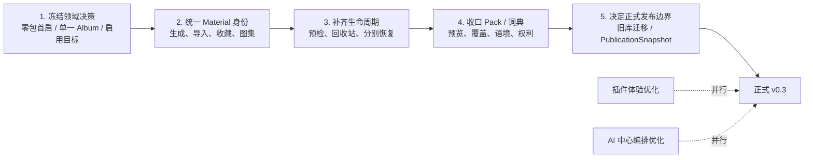

# v0.3 需求／设计／代码对照

日期：2026-08-05  
范围：`apps/desktop` 当前工作树（含未提交实现）；不含 `trash`、安装包与分发产物。

## 结论

`apps/desktop` 已经是可运行的 **v0.3 Alpha／预发布候选**：Creator 主链路、生成任务、词典、历史事实层、本地空间、SQLite 存储和受管目录均已形成真实产品能力。插件与 AI 中心也已有基础闭环，后续重点确实是体验和能力编排。

但若以正式 P0 真源验收，当前还不能称为“除插件、AI 中心外均已完成”。主要问题不在页面数量，而在 6 个跨域合同：**零包首启、图集单一权威、内容包启用目标、Material 身份、删除恢复、旧库迁移／发布快照**。

> 建议对外状态保持 `v0.3 Alpha / active preview`；完成下述 P0 收口后再声明正式 v0.3。

## 判定基线

冲突时采用以下优先级：

1. [内容组织、生命周期与受管目录 v3](../../../../../tools/docs/key-requirements/content-organization-lifecycle-v3.md#L3)：Desktop 对象、关系和生命周期最高优先级；
2. [图集、创作与词典交互 v2](../../../../../tools/docs/key-requirements/albums-creations-dictionary-v2.md#L448)：交互和视觉细节；
3. [v0.3 核心需求与验收](../../../../../tools/docs/v0.3/05-core-requirements-and-acceptance.md#L1)：正式 P0 范围；其中 `Project / MaterialCollection` 旧表述按 v3 映射；
4. [v0.3 README](../../../../../tools/docs/v0.3/README.md#L13)：AIDoList、WorkDraft、AIDoItem、DelegationSnapshot 已明确延期，不计为当前缺口。

状态：✅ 成型；🟡 已可用但未收口；🔴 与当前 P0／最高优先级设计冲突；◻️ 已明确延期。

## 领域总览

| 领域                | 当前代码                                                                            | 对照结论                                                                                     |
| ------------------- | ----------------------------------------------------------------------------------- | -------------------------------------------------------------------------------------------- |
| Creator 与生成      | 草稿、直接生成／编辑、重试、比较、标注、方向实验、部分成功、后台任务恢复均已落地    | ✅ 主链路成型，满足 `V03-P0-15` 及大部分 CREATE/BATCH                                        |
| Prompt 与历史事实   | 冻结共同输入、每模型实际请求、模型快照、提供方返回描述，并在详情分层展示            | ✅ `V03-P0-10 / 22` 基本成型                                                                 |
| 本地空间与摄取      | 空间新建／打开／切换、拖放／粘贴／导入均存在                                        | 🟡 空间能力成型，但首启自动装包且开始页缺少空白创作，违反 FE-01～03                          |
| 图集与素材浏览      | 嵌套、移动、排序、归档、查询投影、词典查询树均存在                                  | 🔴 Creator 与素材库实际使用两套普通图集树，违背“同一棵树／同一 AlbumProjection”              |
| Material 与生命周期 | 对象存储、图片资产、收藏、来源元数据、软删除已有基础                                | 🔴 生成结果先只有 `image_asset`；Material 身份按需补建，且素材／创作／图集缺少完整回收站恢复 |
| 词典                | TermRevision、Facet、模型表达、证据、媒体、词盘和检索均可用                         | 🟡 日常编辑成型；显式 Concept／ContextProfile／人工等价候选和 LocalOverride UI 未收口        |
| 内容包与上下文      | manifest、不可变 release、依赖、Installation／Attempt、幂等和中断恢复的存储层较完整 | 🟡／🔴 安装预览不足；Album 被用作启用目标；UserPackDraft 未落地                              |
| 来源、权利与用途    | 内外部生成元数据、派生关系、Prompt 反查已有实现                                     | 🟡 来源可追溯；权利、用途／采用和声明对象仍未独立建模                                        |
| 受管目录、IPC、安全 | 数据库权威、稳定 ID、对象区／可读目录投影、typed IPC、sender 校验和进程隔离         | ✅ 工程底座成型                                                                              |
| 旧库迁移与发布      | 支持当前 baseline 和精确已知 v0.3 lineage                                           | 🔴 不等于“每个现有资料库可无损升级”；未见 PublicationSnapshot 工作流                         |
| 插件                | manifest、权限、启停、卸载、本地安装、凭据和多 provider 配置已存在                  | 🟡 基础闭环存在；信息架构、安装体验、能力发现和错误恢复仍需优化                              |
| AI 中心             | Activity、详情、定位／重试、Capabilities、provider 配置和助手路由已存在             | 🟡 基础闭环存在；跨任务聚合、状态解释和统一编排仍需优化                                      |
| AIDoList 等         | 当前版本未实现                                                                      | ◻️ 已明确移至 P1，不阻断本期                                                                 |

## 关键差异

### 1. 首启不是“零包自由开始”

- 需求要求默认空间零包，并用“是否存在可恢复用户工作”决定开始页，而不是用词条是否非空（[FE-01](../../../../../tools/docs/v0.3/05-core-requirements-and-acceptance.md#L42)）。
- 当前每次建立资料库上下文都会自动 seed `creation-starter`（[index.ts](../../../src/main/index.ts#L682)，[manifest](../../../content-packs/creation-starter/manifest.json#L13)）。
- `isLibraryEmpty()` 把 Term、词盘和 Album 也算作用户已开始（[intake-repository.ts](../../../src/main/database/intake-repository.ts#L407)），因此新空间通常不会显示开始页。
- 即使显示开始页，空态只有选择图片、导入内容包、打开空间；空白创作仅在先摄取内容后出现（[LibraryStartScreen.tsx](../../../src/renderer/features/intake/LibraryStartScreen.tsx#L82)）。

**处理：** 要么删除自动 seed 并补空白创作入口；要么正式修订 FE-01～03。两者不能同时保留。

### 2. Album 权威发生两处反向实现

最高优先级设计冻结了两条规则：Album 永远不是包启用目标（[v3](../../../../../tools/docs/key-requirements/content-organization-lifecycle-v3.md#L331)）；素材和创作侧栏显示同一棵普通图集树（[v2](../../../../../tools/docs/key-requirements/albums-creations-dictionary-v2.md#L476)）。

当前代码却：

- 将 Activation target 写成 `ALBUM | CONVERSATION`，并同步 Album 默认词典来源（[pack-repository.ts](../../../src/main/database/pack-repository.ts#L221)，[pack-repository.ts](../../../src/main/database/pack-repository.ts#L1274)）；
- 在图集设置中直接编辑 `dictionaryScope`（[AlbumCreationDefaultsDialog.tsx](../../../src/renderer/components/albums/AlbumCreationDefaultsDialog.tsx#L234)）；
- 当前 baseline 将素材库图集与 Creator 图集分开（[v03-baseline.sql](../../../src/main/database/sql/v03-baseline.sql)）；Creator 查询排除 `MATERIAL_LIBRARY`（[album-repository.ts](../../../src/main/database/album-repository.ts#L67)），Gallery 使用独立 `materialAlbums*` API（[GalleryScreen.tsx](../../../src/renderer/components/GalleryScreen.tsx#L385)）。

**处理：** 先做产品决策。若 v3 仍是真源，应合并普通图集权威，并把持久启用目标迁移到 `PromptSeries / Conversation`；Album 只提供“新建创作时复制默认值”的非权威模板也必须在文档中明确定义。

### 3. Blob／ImageAsset／Material 尚未形成单一交接合同

- v3 要求 Blob 与 Material 分离，所有用户关系使用稳定 `materialId`（[v3](../../../../../tools/docs/key-requirements/content-organization-lifecycle-v3.md#L24)）；生成成功也必须立即取得 `materialId`（[HANDOFF-01](../../../../../tools/docs/v0.3/05-core-requirements-and-acceptance.md#L253)）。
- 当前 `finishGeneration()` 只写 `image_assets`（[workbench-repository.ts](../../../src/main/database/workbench-repository.ts#L1389)），`GalleryItemDto.materialId` 仍可为 `null`（[contracts.ts](../../../src/shared/contracts.ts#L610)）。加入图集等动作才按需建立／恢复 Material。

这会使收藏、图集、删除、来源和反向查询在不同入口使用不同身份。应在每个生成／导入成功事务中建立 Material，并让 renderer 关系操作统一使用 `materialId`；Blob／asset 只负责字节与 rendition。

### 4. 软删除已存在，恢复闭环尚未存在

- 创作删除已有 `KEEP / TRASH` 和事务处理（[workbench-repository.ts](../../../src/main/database/workbench-repository.ts#L1242)），Album／asset 也写 tombstone。
- 公开 IPC 只有 `promptSeriesDelete` 和 `assetDelete`（[contracts.ts](../../../src/shared/contracts.ts#L2677)，[contracts.ts](../../../src/shared/contracts.ts#L2748)），未提供 `restorePromptSeries`、已删除素材／创作入口或图集回收站恢复。
- 创作删除也未按验收冻结 `seriesRevision + outputMaterialIds`；当前 TRASH 直接软删 `image_assets`，进一步暴露 Material 身份未统一。

因此 `V03-P0-16～18` 及 MAT-02、CREATION-DELETE-01、MCOL-02 只能判为部分完成。

### 5. 内容包底座强，P0 产品闭环仍缺

- 正面：release／item 不可变约束、Installation／Attempt 状态机、依赖记录、失败回滚、幂等、禁用和卸载均已有真实存储实现。
- 缺口：安装确认仅显示版本、条目数和依赖数（[PackScreen.tsx](../../../src/renderer/features/packs/PackScreen.tsx#L382)）；本地导入选定目录后直接写入（[storage-handlers.ts](../../../src/main/ipc/storage-handlers.ts#L39)）。安装动作要求依赖已安装，并未在同一流程中解析、预览和安装依赖闭包。尚未满足写入前展示依赖闭包、来源、体积、权利、冲突和可选依赖取舍。
- `local_overrides` 只有 repository/facade 和测试调用（[pack-repository.ts](../../../src/main/database/pack-repository.ts#L1315)），生产词典编辑未接入；源码／schema 未见 `UserPackDraft`。
- Term 已有 revision、Facet 和 model expression，但源码／schema 未见独立 Concept、ContextProfile 或人工等价候选对象。

对应 `V03-P0-03 / 04` 的存储核心接近完成，`P0-05～09 / 12` 仍需收口。

### 6. 正式发布范围与当前预发布范围不同

- schema 初始化只接受当前 baseline 或严格命中的已知 v0.3 lineage，未知库明确拒绝（[schema.ts](../../../src/main/database/schema.ts#L252)）。这与 `V03-P0-13 / MIG-01` 的“每个现有资料库可无损继续使用并冻结本地知识基线”不同。
- `src` 与 schema 中未见 PublicationSnapshot／发布快照工作流，`V03-P0-14 / PUB-01` 未实现。
- 现有[发布收敛记录](../../release/v0.3-readiness.md)已经把这两项排除在“活动预发布”之外，并明确不声称完成全部正式 P0；这与代码一致，但与正式 P0 表仍是两个里程碑。

## P0 分组判定

| P0     | 判定   | 说明                                                          |
| ------ | ------ | ------------------------------------------------------------- |
| 01～02 | 🔴     | 空间能力存在；零包首启和完整起步入口不符合验收                |
| 03～04 | ✅／🟡 | Pack 存储状态机成型；安装预览、冲突处置和可选依赖 UX 未完成   |
| 05～08 | 🔴     | 三轴基础存在，但启用目标错误；覆盖未接 UI，UserPackDraft 缺失 |
| 09     | 🟡     | Term 模型表达可用，三层语义和人工等价决策未完整建模           |
| 10、22 | ✅     | PromptVersion／ExecutionInputSnapshot／四层事实显示成型       |
| 11～12 | 🟡     | 统一素材、来源和安全卸载有基础；权利／用途及影响预览不足      |
| 13～14 | 🔴     | 通用旧库兼容和发布快照未进入当前预发布实现                    |
| 15     | ✅     | 生成、重试、比较、摄取和素材整理主流程可用                    |
| 16～19 | 🔴／🟡 | 投影和软删除有基础；双图集、Material 双身份和恢复缺口未收口   |
| 23     | 🟡     | 内部运行反查较完整；外部声明、用途和 Material 统一身份不足    |

此表是合同判定，不把条目数量换算成完成百分比。

## 建议收敛顺序

1. **先改合同，不先抛光。** 对零包 seed、双图集和 Album Activation 做一次明确 ADR；这是后续迁移和 UI 的上游。
2. **以 `materialId` 统一交接。** 生成／导入成功即建 Material，再补素材、创作和图集各自可发现的回收站与恢复动作。
3. **完成 Pack／词典最小 P0。** 安装前预览、依赖冲突、卸载影响、LocalOverride UI；UserPackDraft 若不做，应从当前 P0 明确延期。
4. **统一里程碑口径。** 若 0.3 只交付 active preview，应从正式 P0 表拆出迁移和 PublicationSnapshot；否则必须实现后再发布。
5. **插件／AI 中心独立迭代。** 保留现有基础闭环，另设可用性、能力发现、路由和故障恢复验收，不用它们掩盖上述领域缺口。

## 文档与代码维护项

- `05-core-requirements-and-acceptance.md` 前言虽声明以 v3 为准，正文仍大量使用 Project／MaterialCollection；建议直接改写为 PromptSeries／Conversation／Album，减少二次解释。
- `0082`、Album Activation 和 starter seed 都是明确的产品决策，却与高优先级文档相反；决策后必须同步代码迁移、设计基线和验收用例。
- `TREE-VIS-01` 仍由设计文档标为未通过（[记录](../../../../../tools/docs/key-requirements/albums-creations-dictionary-v2.md#L227)）；它是已知视觉缺口，不应冒充已验收，也不应优先于身份／生命周期合同。
- `CreatorScreen.tsx` 当前约 3,515 行，`App.tsx` 仍消费聚合 bootstrap 并保留访问过的 screen；属于维护／大库性能风险，不是本轮 P0 行为阻断。

## 当前验证

| 检查                | 2026-08-05 当前工作树                                                                                                                                                                                                                                                                    |
| ------------------- | ---------------------------------------------------------------------------------------------------------------------------------------------------------------------------------------------------------------------------------------------------------------------------------------- |
| `npm run typecheck` | 通过                                                                                                                                                                                                                                                                                     |
| `npm test`          | 50 文件、224 用例全部通过                                                                                                                                                                                                                                                                |
| `npm run test:all`  | 102/103 文件、468/471 用例通过；3 项失败                                                                                                                                                                                                                                                 |
| 失败范围            | 均在 `codex-temp-lifecycle.integration.test.ts`；mock 仍只返回 `optimizedPrompt`，而 optimize 结果现已强制要求结构化 `promptDraft.contentNodes`（[validator](../../../src/main/assistant-prompt-draft.ts#L66)，[旧 mock](../../../tests/codex-temp-lifecycle.integration.test.ts#L107)） |
| build/package/make  | 未执行；本次为文档对照，且仓库规则禁止默认生成分发产物                                                                                                                                                                                                                                   |

正式 v0.3 的最低放行条件应为：上述 🔴 合同完成或从正式 P0 经决策移出、`test:all` 恢复全绿、真实 provider 完成一次生成／失败／取消／重试／重启恢复人工冒烟。
